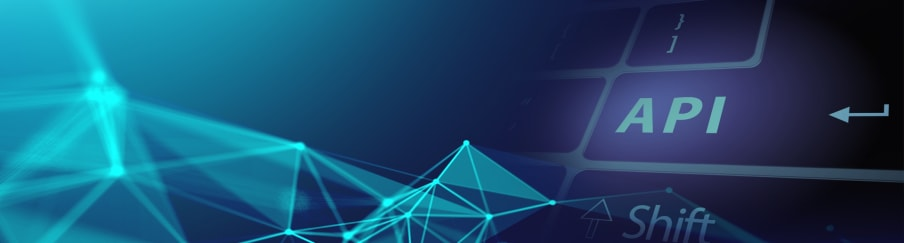

# API Basics

* What an API is (definition, purpose, use cases).
* Types of APIs: REST, GraphQL, SOAP, gRPC.
* Client–server model and statelessness.

# RESTful APIs

* Principles of REST (resources, URIs, representation).
* CRUD operations via API (GET, POST, PUT, DELETE).
* HTTP Methods & Idempotency.
* Common HTTP Status Codes (200, 201, 400, 401, 403, 404, 500, etc.).
* Request/Response structure (headers, body, query params, path params).

# Data Formats & Serialization

* JSON (most common) & XML.
* Serialization vs Deserialization.

# Authentication & Authorization

* API keys (basic level).
* OAuth 2.0 & OpenID Connect.
* JWT (JSON Web Tokens).
* Session vs token-based auth.
* Role-based access control (RBAC).

# Error Handling

* Proper use of status codes.
* Error messages & structured error responses.
* Retry logic & rate limiting concepts.

# API Security

* HTTPS & TLS.
* CORS (Cross-Origin Resource Sharing).
* Input validation & sanitization.
* Rate limiting & throttling.

# API Testing & Tools

* Using **Postman** for building & testing APIs.
* Using **cURL** from the command line.
* Mock APIs (Mockoon, JSON Server).
* Writing automated API tests (JUnit, Pytest, Jest, etc.).

# API Documentation & Standards

* OpenAPI/Swagger.
* API versioning (v1, v2).
* Good documentation practices.

# Advanced Topics

* GraphQL basics (queries, mutations, resolvers).
* WebSockets (real-time communication).
* gRPC (high-performance RPC).
* API Gateways (AWS API Gateway, Kong, NGINX).
