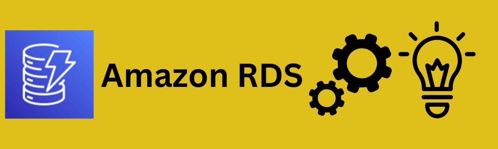

# Amazon RDS

---

## 1. **What is Amazon RDS?**

Amazon RDS (Relational Database Service) is a **managed database service** by AWS that makes it easy to set up, operate, and scale relational databases in the cloud.

Instead of manually installing and managing a database on EC2, RDS handles:

* Database provisioning
* Backups
* Patching
* Scaling
* High availability

It lets developers **focus on queries and schema design** rather than database administration.

---

## 2. **Supported Database Engines**

RDS supports multiple popular relational databases:

* **Amazon Aurora** (AWS’s cloud-optimized DB, MySQL/PostgreSQL compatible)
* **MySQL**
* **PostgreSQL**
* **MariaDB**
* **Oracle**
* **Microsoft SQL Server**

👉 Use case:

* Aurora = high-performance, AWS-optimized
* PostgreSQL = modern, open-source, complex apps
* MySQL = web apps (WordPress, e-commerce)
* Oracle / SQL Server = enterprise apps that require licenses

---

## 3. **Key Features**

1. **Automated Backups** – Daily backups + transaction logs for point-in-time recovery.
2. **Multi-AZ Deployment** – High availability by replicating data to a standby instance in another AZ.
3. **Read Replicas** – Horizontal read scaling by creating replicas of the main database.
4. **Monitoring** – CloudWatch integration for metrics (CPU, memory, connections, IOPS).
5. **Security** – Encryption at rest (KMS), in transit (SSL), IAM authentication, VPC isolation.
6. **Automatic Patching** – RDS applies updates to the database engine for you.

---

## 4. **RDS vs. Aurora**

* **RDS (MySQL/Postgres)** → Traditional engines, runs on managed instances.
* **Aurora** → AWS’s custom-built relational DB with:
  * 5x performance of MySQL / 3x PostgreSQL
  * Storage auto-scales up to 128TB
  * 15 read replicas (vs 5 in RDS)
  * Fault-tolerant, self-healing storage

👉 For mission-critical apps, **Aurora** is usually better.

---

## 5. **RDS Storage Types**

* **General Purpose SSD (gp3/gp2)** → Balanced cost/performance.
* **Provisioned IOPS (io1/io2)** → High-performance, low-latency apps (e.g., financial trading).
* **Magnetic (deprecated)** → Legacy, slower.

---

## 6. **Scaling in RDS**

* **Vertical scaling (instance class)** → Upgrade to larger instance type (e.g., db.t3.medium → db.r5.2xlarge).
* **Horizontal scaling** :
* **Read replicas** for read-heavy apps.
* **Aurora Serverless** auto-scales compute capacity up/down based on load.

---

## 7. **High Availability**

* **Multi-AZ deployments** :
* Primary DB in one AZ.
* Standby replica in another AZ.
* Failover is automatic (DNS swap).

👉 Critical for production apps to avoid downtime.

---

## 8. **Security**

* **VPC isolation** → Place DB inside private subnet.
* **IAM authentication** → Apps can authenticate using IAM instead of passwords.
* **Encryption** :
* At rest with AWS KMS.
* In transit with SSL/TLS.
* **Security groups** → Control inbound/outbound DB access.

---

## 9. **Monitoring & Maintenance**

* **CloudWatch** → Monitor CPU, memory, disk, IOPS.
* **Enhanced Monitoring** → OS-level metrics.
* **Performance Insights** → Find slow queries & bottlenecks.
* **Maintenance Window** → Schedule patching & upgrades.

---

## 10. **RDS Pricing**

You pay for:

1. **Instance hours** (size + engine type).
2. **Storage** (GB/month).
3. **IOPS** (if provisioned).
4. **Data transfer** (in/out).
5. **Backups beyond free storage (snapshot storage costs).**

👉 Cost optimization tip: Use **reserved instances** or **Aurora Serverless** if workloads are variable.

---

## 11. **RDS Use Cases**

* **E-commerce apps** (Magento, WooCommerce, Shopify backend).
* **Web apps** (WordPress, Django, Flask).
* **ERP/CRM systems** .
* **Analytics dashboards** with read replicas.
* **Mobile & gaming backends** (Aurora Serverless).

---

## 12. **RDS Hands-on Example (with boto3 in Python)**

```python
import boto3

# Create RDS client
rds = boto3.client('rds')

# Example: Create Aurora MySQL cluster
response = rds.create_db_cluster(
    DBClusterIdentifier='my-aurora-cluster',
    Engine='aurora-mysql',
    MasterUsername='admin',
    MasterUserPassword='StrongPass123!',
    BackupRetentionPeriod=7,
    StorageEncrypted=True,
    EngineMode='provisioned',
    DBSubnetGroupName='my-subnet-group',
    VpcSecurityGroupIds=['sg-1234567890abcdef0']
)

print("Aurora cluster created:", response)
```

---

## 13. **Best Practices**

* Always enable **Multi-AZ** for production.
* Use **parameter groups** to fine-tune DB engine settings.
* Enable **automated backups** and test restores.
* Use **read replicas** for analytics or reporting workloads.
* Place DB in **private subnet** (not publicly accessible).
* Use **IAM authentication** instead of hardcoding credentials.

---

## 14. **RDS Interview Questions**

1. What’s the difference between  **RDS vs Aurora** ?
2. How does **Multi-AZ** differ from  **Read Replicas** ?
3. How does RDS handle  **failover** ?
4. When would you use  **Provisioned IOPS** ?
5. How do you secure an RDS instance inside a VPC?
6. How would you migrate an on-premises DB to RDS? (hint: DMS - Database Migration Service).
