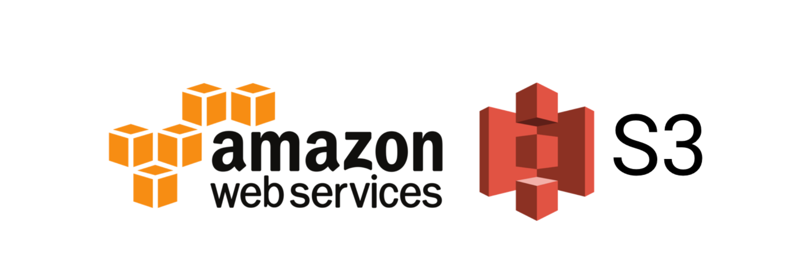
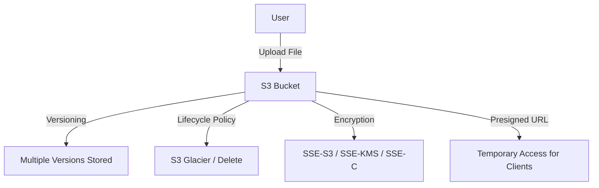

# Amazon S3

---

## 1. **What is Amazon S3?**

Amazon Simple Storage Service (S3) is AWS’s  **object storage service** .

* Stores **objects** (files, images, backups, logs, etc.) in  **buckets** .
* Infinite storage, 11 nines of durability (99.999999999%).
* Scales automatically.
* Pay for what you use (storage + requests + data transfer).

---

## 2. **Core S3 Concepts**

* **Buckets** → containers for objects.
* **Objects** → files/data (max size: 5TB).
* **Keys** → unique identifier for each object (`bucket-name/key`).
* **Regions** → buckets live in a specific AWS region.

---

## 3. **S3 Versioning**

* Allows keeping **multiple versions** of the same object.
* Protects against accidental deletion or overwrite.

📌  **How it works** :

* Once enabled, every time you upload a new version of an object, S3 assigns a  **version ID** .
* Even if you delete the object, S3 keeps a "delete marker" — older versions are still retrievable.

📌  **Use Cases** :

* Protect against accidental deletes.
* Maintain history of documents/files.

📌  **Interview Tip** :

Versioning cannot be **disabled** once enabled — only  **suspended** .

---

## 4. **Lifecycle Policies**

* Automates object **transition** between storage classes and  **expiration** .
* Rules are set at bucket or prefix level.

📌  **Storage Classes** :

* S3 Standard → frequently accessed data.
* S3 Standard-IA (Infrequent Access).
* S3 One Zone-IA → cheaper, but single AZ.
* S3 Glacier / Glacier Deep Archive → archival storage.
* S3 Intelligent-Tiering → automatically moves data between tiers.

📌  **Example Lifecycle Policy** :

* After 30 days → move to Standard-IA.
* After 90 days → move to Glacier.
* After 365 days → delete permanently.

📌  **Use Cases** :

* Cost optimization for logs, backups, infrequently used data.

---

## 5. **S3 Encryption**

S3 supports **server-side** and **client-side** encryption.

### a) **Server-Side Encryption (SSE)**

* **SSE-S3** → AWS manages keys.
* **SSE-KMS** → AWS KMS manages keys, with more control/audit.
* **SSE-C** → Customer manages keys.

### b) **Client-Side Encryption**

* You encrypt data before uploading.

📌  **Default Encryption** : You can enforce all new objects in a bucket to be encrypted automatically.

📌  **Interview Tip** :

Most enterprises use **SSE-KMS** because it integrates with IAM permissions & CloudTrail auditing.

---

## 6. **Presigned URLs**

* A **temporary signed URL** that allows access to a private object in S3 without making the bucket public.
* Generated by an IAM user/role with permission.
* Can allow **GET (download)** or  **PUT (upload)** .
* Expiry time configurable (default max: 7 days with AWS SDKs).

📌  **Use Cases** :

* Sharing a private file temporarily.
* Allowing clients to upload files directly to S3 without going through your backend.

📌  **Example (Python boto3)** :

```python
import boto3

s3 = boto3.client('s3')

url = s3.generate_presigned_url(
    'get_object',
    Params={'Bucket': 'my-bucket', 'Key': 'report.pdf'},
    ExpiresIn=3600  # 1 hour
)

print("Presigned URL:", url)
```

---

## 7. **Security Best Practices**

* Block Public Access (default).
* Use **bucket policies** and **IAM roles** for fine-grained permissions.
* Use **SSE-KMS** for encryption.
* Enable **MFA Delete** for versioned buckets (extra protection).
* Use **Access Logs** + **CloudTrail** for auditing.

---

## 8. **S3 Interview-Level Scenarios**

1. **Q: How do you protect data from accidental deletion?**

   → Enable **versioning** +  **MFA delete** .
2. **Q: How do you reduce costs for old logs?**

   → Use **lifecycle policies** to transition to Glacier.
3. **Q: How do you securely share a private file?**

   → Generate a  **presigned URL** .
4. **Q: Which encryption method gives most control?**

   →  **SSE-KMS** , because you can audit and control access to KMS keys.

---

## 9. **Mermaid Diagram (S3 Lifecycle & Access)**



---
