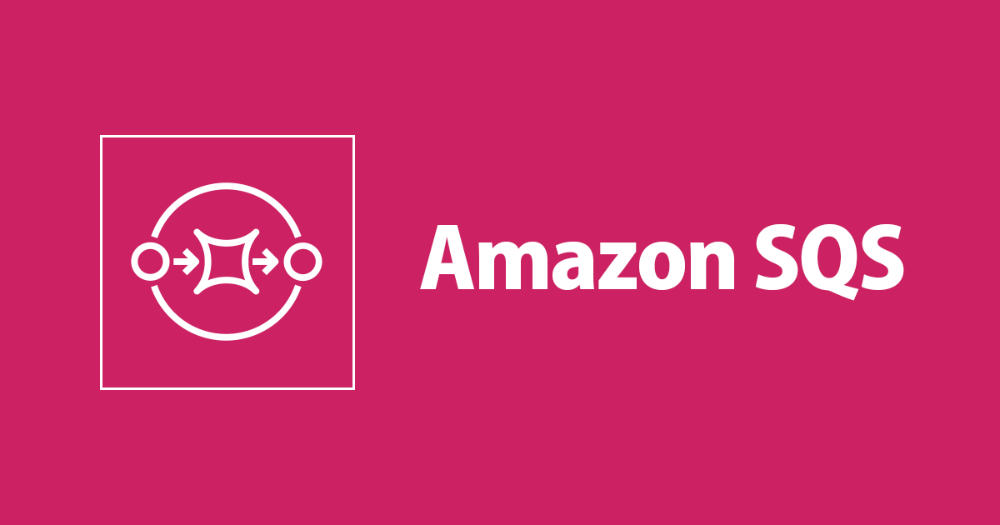

# Amazon SQS (Simple Queue Service)

---

## 1. **What is SQS?**

* Fully managed **message queuing service** for decoupling distributed systems.
* Producers send messages → stored in queue → consumers poll and process them.
* Guarantees **at least once delivery** (but not exactly once, unless using FIFO).

👉 **Think of SQS as a shock absorber between microservices.**

---

## 2. **Core Concepts**

* **Producer** → Sends a message.
* **Queue** → Stores messages until processed.
* **Consumer** → Reads messages, processes them, deletes after success.
* **Visibility Timeout** → Message is hidden from other consumers while being processed (default 30s, configurable). If not deleted before timeout, message becomes visible again.
* **Dead Letter Queue (DLQ)** → Holds messages that repeatedly fail processing (to prevent poison messages clogging the system).

---

## 3. **Queue Types**

### 🔹 Standard Queue (default)

* High throughput (nearly unlimited).
* **At least once delivery** (messages may be duplicated).
* **Best-effort ordering** (order not guaranteed).

👉 Use when:  **throughput > strict ordering** .

---

### 🔹 FIFO Queue (First In, First Out)

* Guarantees **exactly once processing** (no duplicates).
* Guarantees **ordering** (messages are processed in order sent).
* Limited throughput (3,000 msg/sec with batching).

👉 Use when:  **financial transactions, workflows needing strict order** .

---

## 4. **Key Features**

* **Decoupling** : Producers don’t need to wait for consumers.
* **Scalability** : Automatically scales with traffic.
* **Reliability** : Highly available, durable storage across AZs.
* **Security** : IAM policies, SSE encryption (KMS), VPC endpoints.
* **Cost** : Pay per request ($0.40 per million API calls).

---

## 5. **Common Integration Patterns**

* **SQS + Lambda** : Serverless message-driven processing.
* **SQS + EC2/ECS** : Worker fleet pulling jobs from a queue.
* **SNS → SQS** : Fan-out (SNS publishes → multiple SQS queues receive).
* **DynamoDB Streams → SQS** : Capture and process DB changes asynchronously.

---

## 6. **Visibility Timeout & Delivery Guarantees**

* **Visibility Timeout:**
  * Prevents multiple consumers from processing the same message simultaneously.
  * If consumer fails to delete the message in time, SQS re-delivers.
* **Delivery Guarantees:**
  * Standard: **At least once delivery** (can duplicate).
  * FIFO: **Exactly once delivery** (no duplicates).

👉 Best practice: **Make consumers idempotent** (safe to process the same message twice).

---

## 7. **Dead Letter Queues (DLQ)**

* Captures messages that fail processing multiple times.
* Prevents **poison messages** from causing infinite retries.
* Configure **maxReceiveCount** (e.g., 5 attempts before sending to DLQ).

👉 Example: A corrupted file message in an SQS-based ETL pipeline → moves to DLQ for manual inspection.

---

## 8. **Message Lifecycle**

1. Producer sends message.
2. Message stored redundantly across AZs.
3. Consumer polls and retrieves the message.
4. Message becomes invisible (visibility timeout).
5. Consumer processes and **deletes** message.
6. If not deleted → reappears in queue after timeout.

---

## 9. **Best Practices**

* **Idempotent Consumers** → Handle duplicate messages gracefully.
* **Right Queue Type** → FIFO for ordering/exactly-once, Standard for scale.
* **Batching** → Reduce costs (10 messages per request).
* **DLQ Setup** → Always configure a Dead Letter Queue for resilience.
* **Long Polling (20s)** → Reduces empty responses, saves cost vs short polling.
* **Security** → Use IAM policies, encrypt messages with KMS, restrict queue access.

---

## 10. **Common Pitfalls & Solutions**

| Pitfall                         | Solution                                           |
| ------------------------------- | -------------------------------------------------- |
| Messages processed twice        | Make consumers idempotent                          |
| Poison messages block queue     | Configure DLQ                                      |
| Costs increase with empty polls | Use Long Polling                                   |
| FIFO queue throughput too low   | Consider sharding across multiple FIFO queues      |
| Consumers overloaded            | Use auto-scaling (Lambda concurrency, ECS scaling) |

---

## 11. **Example Architectures**

1. **Image Processing Pipeline**
   * User uploads to S3 → S3 event triggers Lambda → puts job in SQS → ECS workers pull from SQS → process images → save results.
2. **Order Processing System (FIFO)**
   * Orders → FIFO queue → Lambda → DynamoDB.
   * Ensures orders are processed  **in order and exactly once** .
3. **Fan-out Event System (SNS + SQS)**
   * Event in SNS → multiple SQS queues (for billing, notifications, analytics).
   * Each consumer processes independently.

---

## 12. **When NOT to Use SQS**

* Real-time, low-latency streaming (use Kinesis or Kafka).
* Bidirectional communication (use WebSockets, not queues).
* Extremely high message ordering requirements at very high scale (FIFO is throughput-limited).
