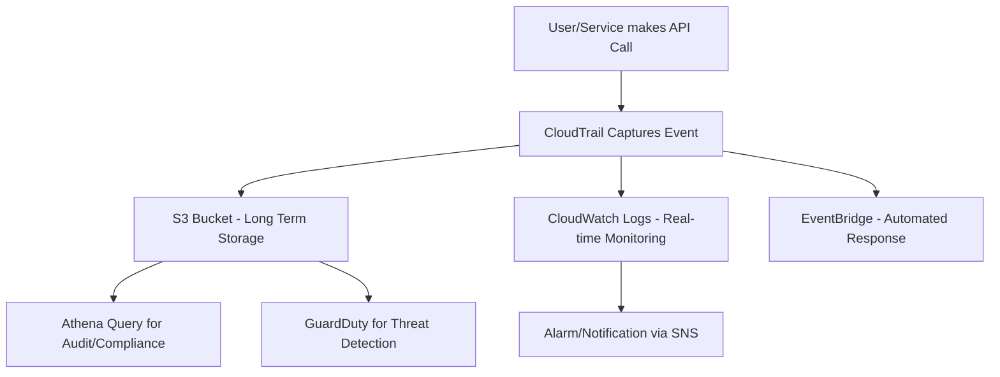

# AWS CloudTrail

---

## 1. **What is CloudTrail?**

CloudTrail is AWS’s  **audit and governance logging service** .

It answers:

* *“Who did what, when, from where, and to what in my AWS account?”*

It records **API calls and actions** made in AWS, whether via:

* AWS Management Console
* AWS CLI
* SDKs (Python boto3, Java, etc.)
* AWS Services acting on your behalf

### Why it matters

* **Security** → detect suspicious activity (e.g., someone opening SG ports to 0.0.0.0).
* **Compliance** → meet regulations like PCI-DSS, HIPAA, SOX by proving auditability.
* **Troubleshooting** → track why an EC2 was terminated, who changed IAM policy.

---

## 2. **Core Concepts**

### a) **Events**

CloudTrail logs  **events** , which are JSON records of activity.

Example fields:

* `eventTime`: when it happened
* `eventSource`: service (e.g., `ec2.amazonaws.com`)
* `eventName`: action (e.g., `RunInstances`)
* `userIdentity`: who made the call
* `sourceIPAddress`: from where

📌 Example use case: *An EC2 was terminated. CloudTrail shows: eventName=`TerminateInstances`, userIdentity=`IAM user Bob`, sourceIPAddress=`11.22.33.44`.*

---

### b) **Event Types**

* **Management Events**
  * Control-plane actions (create/delete/update resources).
  * Example: `CreateBucket`, `DeleteDBInstance`.
* **Data Events** *(more detailed, higher volume)*
  * Object/data-level access.
  * Example: `GetObject` from S3, `PutItem` in DynamoDB.
* **Insights Events** *(anomaly detection)*
  * Detect unusual activity.
  * Example: sudden spike in `StartInstances` calls.

---

### c) **Trails**

* A **trail** defines where CloudTrail delivers logs (S3, CloudWatch).
* By default: CloudTrail records **90 days of management events** in the console (called  *event history* ).
* For long-term retention: you must create a **trail** → stores logs in  **S3** .

---

## 3. **CloudTrail Architecture**

1. **User/Service makes an API call** (console, CLI, SDK).
2. **CloudTrail records the event** .
3. **Event is delivered** :

* Stored in S3 (immutable audit log).
* Sent to CloudWatch Logs for real-time monitoring/alerts.
* Optional → Sent to EventBridge for automated responses (e.g., auto-remediate).

---

## 4. **Security & Compliance Use Cases**

### a) **Security Monitoring**

* Detect unauthorized API calls.
* Detect IAM policy changes.
* Trigger alarms when root account logs in.

### b) **Forensics**

* If data is leaked or deleted, you can trace  **who did it, when, and how** .

### c) **Compliance**

* Financial (PCI-DSS), Healthcare (HIPAA) → must show full logs of access/modifications.
* CloudTrail provides  **tamper-evident audit logs** .

---

## 5. **Integrations**

* **S3** → for log storage (use encryption + versioning + MFA Delete for security).
* **CloudWatch Logs** → create real-time alerts (e.g., notify if `DeleteBucket` is called).
* **Athena** → query CloudTrail logs in S3 with SQL.
* **GuardDuty** → uses CloudTrail data for threat detection.
* **EventBridge** → automate responses to suspicious events.

---

## 6. **Best Practices**

✅ **Enable CloudTrail in all regions** → prevents “shadow IT” in unused regions.

✅ **Send logs to central S3 bucket** → across accounts (for centralized auditing).

✅ **Encrypt logs with KMS** → ensure only authorized roles can read them.

✅ **Enable Log File Integrity Validation** → cryptographic checksums detect tampering.

✅ **Integrate with CloudWatch** → real-time alerts for critical events (e.g., root login, IAM policy change).

✅ **Use Organizations Trail** → enforce across all accounts in AWS Organizations.

✅ **Limit access with IAM least privilege** → not everyone should read CloudTrail logs.

---

## 7. **Example: Financial System**

Imagine an **insurance company** storing sensitive financial data in AWS.

* CloudTrail is  **enabled org-wide** .
* All events (management + data) go to  **central S3 bucket** .
* Logs are  **encrypted with KMS** .
* CloudWatch alarms are set up:
  * Root login attempt.
  * S3 bucket policy change.
  * DynamoDB table deletion attempt.
* Compliance officers query CloudTrail logs with Athena monthly for audit reports.

---

## 8. **Mermaid Diagram of CloudTrail Flow**



---

## 9. **Sample Event Log (JSON Snippet)**

```json
{
  "eventTime": "2025-10-04T20:30:00Z",
  "eventSource": "ec2.amazonaws.com",
  "eventName": "TerminateInstances",
  "awsRegion": "us-east-1",
  "sourceIPAddress": "11.22.33.44",
  "userIdentity": {
    "type": "IAMUser",
    "userName": "bobby"
  }
}
```

---

## 10. **Quick Interview Talking Points**

* CloudTrail =  **audit logging service** .
* Captures  **API calls and actions** .
* Stores in  **S3** , integrates with  **CloudWatch & EventBridge** .
* Supports  **management, data, and insights events** .
* Critical for  **security, compliance, and troubleshooting** .
* Always enable it  **org-wide, encrypted, immutable, and monitored** .
