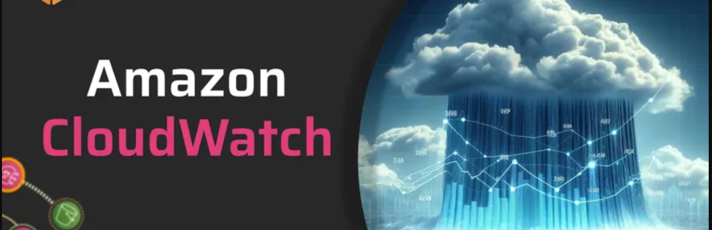
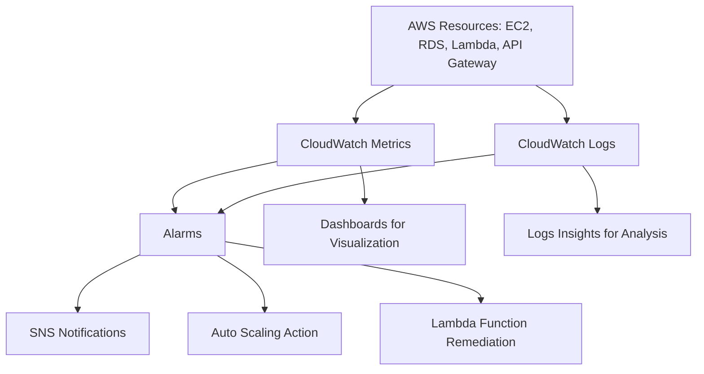

# Amazon CloudWatch

---

## 1. **What is Amazon CloudWatch?**

Amazon CloudWatch is AWS’s  **monitoring, observability, and alerting service** .

It lets you:

* Collect **metrics** (numbers, like CPU % or request latency).
* Collect **logs** (raw text from applications/services).
* Collect **events** (state changes in AWS resources).
* Set **alarms** to notify or automate actions.
* Build **dashboards** for visualization.

### Difference from CloudTrail

* **CloudWatch** = performance/health monitoring.
* **CloudTrail** = governance/audit logging of “who did what.”

---

## 2. **Core Components**

### a) **Metrics**

* Numeric data points about resources.
* Examples:

  * `CPUUtilization` on EC2
  * `Invocations` on Lambda
  * `ReadIOPS` on RDS
  * `IteratorAgeMilliseconds` on Kinesis
* Granularity:

  * Default = 5 minutes
  * Detailed monitoring = 1 minute

---

### b) **Logs**

* Centralized log storage and management.
* Sources:
  * Application logs
  * Lambda logs (stdout/stderr)
  * API Gateway access logs
  * VPC Flow Logs
* Can create **log groups** (e.g., `/app/frontend`, `/app/backend`).
* Supports log  **filtering & metric extraction** .

---

### c) **Alarms**

* Monitor metrics against thresholds.
* Example:
  * If `CPUUtilization > 80%` for 5 mins → trigger alarm.
* Actions on alarm:
  * Send SNS notification (email, SMS).
  * Trigger Auto Scaling policy.
  * Run a Lambda function.

---

### d) **Events (now part of EventBridge)**

* Event-driven monitoring.
* Example: “EC2 instance state = stopped” → trigger action.

---

### e) **Dashboards**

* Visualize metrics and logs in real-time.
* Can mix multiple services on one dashboard.
* Example: EC2 CPU + RDS connections + S3 bucket size.

---

## 3. **CloudWatch Architecture**

1. AWS resources and apps  **publish metrics/logs** .
2. CloudWatch collects and stores them.
3. Users create  **alarms and dashboards** .
4. CloudWatch integrates with **SNS, Lambda, Auto Scaling, EventBridge** for automated actions.

---

## 4. **Key Use Cases**

✅ **System Monitoring**

* Monitor EC2, Lambda, RDS, DynamoDB, API Gateway, etc.
* Detect performance bottlenecks.

✅ **Log Aggregation**

* Collect app logs in one place.
* Search/filter using CloudWatch Logs Insights (SQL-like).

✅ **Alerting & Automation**

* Notify DevOps team if CPU is too high.
* Auto-scale based on traffic.
* Auto-restart instances when unhealthy.

✅ **Security Monitoring**

* Monitor VPC Flow Logs for suspicious IPs.
* Detect IAM policy change attempts with CloudWatch Events.

✅ **Business KPIs**

* You can push **custom metrics** (e.g., number of insurance claims processed/hour).

---

## 5. **Best Practices**

* **Aggregate logs** from all accounts into a central CloudWatch Logs account.
* **Use metric filters** to turn logs into actionable alarms.
* **Set alarms for critical resources** (CPU, disk, memory, API throttling).
* **Use dashboards** for visibility across teams.
* **Export logs to S3** for long-term retention + Athena queries.
* **Integrate with CloudTrail + GuardDuty** for full security coverage.

---

## 6. **Example: Insurance / Financial System**

Imagine an **insurance claim system** hosted on AWS.

* **EC2 instances** run claims APIs → monitored for CPU/memory.
* **RDS database** monitored for storage, connections, replication lag.
* **S3 buckets** log access → sent to CloudWatch Logs.
* **Lambda functions** that process claims → metrics for execution time/errors.
* **Alarms** :
* If RDS connections exceed 90% capacity → notify DB team.
* If Lambda error rate > 5% → trigger SNS notification.
* **Dashboards** :
* Claims processed/hour
* Latency of API requests
* DB health status

---

## 7. **Mermaid Diagram of CloudWatch**



---

## 8. **Example Alarm**

📌 High CPU on EC2 → send notification

```json
{
  "AlarmName": "HighCPUUtilization",
  "MetricName": "CPUUtilization",
  "Namespace": "AWS/EC2",
  "Statistic": "Average",
  "Period": 300,
  "EvaluationPeriods": 1,
  "Threshold": 80,
  "ComparisonOperator": "GreaterThanThreshold",
  "AlarmActions": ["arn:aws:sns:us-east-1:123456789012:NotifyAdmins"]
}

```

---

## 9. **Interview Talking Points**

* CloudWatch = **monitoring + observability** service.
* Collects **metrics, logs, events** from AWS + custom apps.
* Provides  **alarms, dashboards, automation** .
* Key for  **performance, cost optimization, and security monitoring** .
* Often used with CloudTrail, GuardDuty, and EventBridge.
* Crucial in **financial/PII workloads** for monitoring sensitive data flows.

---

✅ So:

* **CloudTrail** = audit logging (“who did what”).
* **CloudWatch** = monitoring/alerting (“how’s it running”).
