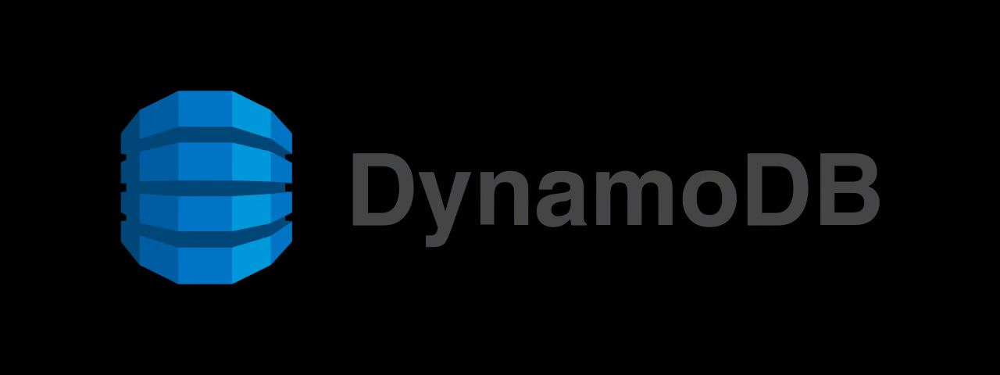

# Amazon DynamoDB

---

## 1. **What is DynamoDB?**

* **Definition** :

  DynamoDB is a **fully managed, serverless NoSQL database** provided by AWS.

* Stores data as **key–value pairs** or  **document-style (JSON-like)** .
* Optimized for **fast, predictable performance** at any scale.
* Scales automatically from  **a few requests/sec to millions** .
* **Think of it like** :

  A highly available, low-latency, globally distributed database where you don’t manage servers.

---

## 2. **Key Characteristics**

1. **NoSQL** → Not relational, no joins, no foreign keys.
   * Data is  **denormalized** .
   * Optimized for **single-table design** with  **access patterns in mind** .
2. **Performance**
   * Consistent single-digit millisecond latency.
   * Option for **DAX (DynamoDB Accelerator)** → in-memory cache → microsecond latency.
3. **Scaling**
   * Supports **on-demand (auto-scaling)** or **provisioned capacity** with auto-scaling policies.
4. **Fully Managed**
   * AWS handles patching, replication, failover, scaling.
5. **Global Tables**
   * Multi-region, active-active replication for global apps.

---

## 3. **Core Concepts**

### **Table**

* Collection of items (like a relational table, but schema-less).

### **Item**

* A row in the table.
* Example:

  ```json
  {
    "UserId": "123",
    "Name": "Alice",
    "Age": 30,
    "Orders": ["A100", "A101"]
  }
  ```

### **Attributes**

* Fields in an item (
* like columns).

### **Primary Keys**

* Every item needs a  **primary key** :
  1. **Partition key only** (simple key).
     * e.g., `UserId`.
  2. **Partition key + Sort key** (composite key).
     * e.g., `UserId` + `OrderDate`.

👉 The **partition key** determines where the data lives (sharding).

***NOTE:* Best Practices for Partition Keys**

* Choose partition keys that:
  * Have **high cardinality** (many unique values).
  * Distribute requests evenly (avoid hot spots).
  * Match your most common access patterns.
* **Bad Partition Key Example** : `Country`
* If most users are in `"US"`, then almost all requests hit the `"US"` partition → hotspot.
* **Good Partition Key Example** : `UserId`
* Each user has unique ID → requests are spread across partitions.

***NOTE:* Why Partition Keys Matter**

* **Performance & Scalability** :

  Data is evenly spread across partitions if partition key values are diverse.

* If too many requests hit the  **same partition key** , you get a **hot partition** → throttling.
* **Querying** :

  You can only query efficiently by partition key (or use indexes).

* Example:
  * `GetItem(UserId=U123)` → efficient.
  * `GetItem(Email=alice@example.com)` → not possible unless you add a  **GSI** .

### **Secondary Indexes**

* Allow querying data by non-primary keys.
* Two types:
  1. **Global Secondary Index (GSI)** → can use any attribute as partition/sort key.
  2. **Local Secondary Index (LSI)** → same partition key as table, but different sort key.

### **Streams**

* DynamoDB Streams capture changes (insert/update/delete).
* Often used to trigger **Lambdas** for real-time processing.

---

## 4. **Data Access Patterns**

* DynamoDB isn’t relational → you design tables  **based on query patterns** , not normalization.

Examples:

1. **Get a user by UserId** → Use partition key `UserId`.
2. **Get all orders for a user** → Partition key `UserId`, Sort key `OrderDate`.
3. **Query by product category** → Use GSI with `Category` as partition key.

---

## 5. **Read/Write Capacity Modes**

1. **Provisioned Mode**
   * You specify **Read Capacity Units (RCUs)** and  **Write Capacity Units (WCUs)** .
   * Auto-scaling adjusts up/down based on traffic.
2. **On-Demand Mode**
   * Pay-per-request, no capacity planning.
   * Great for unpredictable workloads.

---

## 6. **Consistency Models**

* **Eventually Consistent Reads** (default, cheaper, faster).
* **Strongly Consistent Reads** (optional, guaranteed latest data, but slightly slower).

---

## 7. **Pricing**

* Based on:
  * Reads/Writes (RCUs/WCUs or on-demand requests).
  * Storage (per GB).
  * Optional features (DAX, Streams, Global Tables).

---

## 8. **Common Use Cases**

1. **User Profiles & Sessions**
   * Store user data, preferences, tokens.
2. **IoT Data Ingestion**
   * Millions of small, rapid writes.
3. **E-Commerce & Orders**
   * Orders keyed by UserId + OrderId.
4. **Gaming Leaderboards**
   * Sort by scores with sort key.
5. **Serverless Applications**
   * Perfect fit with **Lambda + API Gateway + DynamoDB** stack.

---

## 9. **Best Practices**

* **Design for access patterns upfront** (don’t “normalize” like SQL).
* Use **composite keys** to support multiple queries in one table.
* Use **GSIs sparingly** (extra cost + write amplification).
* Use **DAX** for read-heavy workloads.
* Enable **auto-scaling** or use **on-demand** mode if uncertain.
* Use **Streams + Lambda** for triggers and audit logs.

---

## 10. **Interview-Level Talking Points**

* DynamoDB solves **scaling problems** traditional RDBMS can’t handle (think Amazon.com scale).
* Great for  **high-throughput, low-latency workloads** .
* Tradeoff: You lose joins and relational modeling.
* Best used with a **single-table design** mindset → store multiple entity types in one table, partitioned by key design.
* Global Tables support  **multi-region, multi-master replication** .
* DynamoDB is a  **foundational piece of serverless architectures** .

---

## 11. **Example Architecture**

 **E-commerce orders system** :

* Table: `Orders`
  * Partition Key: `UserId`
  * Sort Key: `OrderDate`
* GSI: `OrderStatus` (so you can query by pending/fulfilled).
* DynamoDB Streams → Lambda → Send updates to EventBridge → Notify customers.
