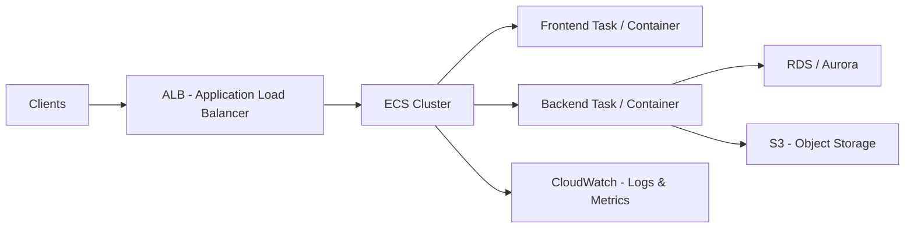

# Amazon ECS

---

## 1. What is Amazon ECS?

Amazon ECS is a **fully managed container orchestration service** by AWS.

* Runs **Docker containers** on AWS.
* Unlike EKS (which runs Kubernetes), ECS is  **AWS-native** , simpler, and integrates tightly with other AWS services.
* Supports both:
  * **EC2 launch type** → you manage the EC2 instances.
  * **Fargate launch type** → serverless, no instances to manage.

Think of ECS as  **AWS’s own container orchestration platform** .

---

## 2. Core Concepts

### 🔹 a) Cluster

* A logical group of **EC2 instances or Fargate compute resources** where your containers run.
* Example: `InsuranceAppCluster` contains frontend and backend services.

---

### 🔹 b) Task Definition

* Blueprint for running a container.
* Defines:
  * Docker image to use.
  * CPU and memory requirements.
  * Networking mode (bridge, awsvpc, host).
  * Environment variables and IAM roles.
* Example: Backend task definition → `insurance-backend:latest` image, 512MB RAM, 1 vCPU.

---

### 🔹 c) Task

* An **instance of a task definition** running on a cluster.
* Can be **single-container** or **multi-container** (sidecars).
* Example: One running backend container processing claims.

---

### 🔹 d) Service

* Ensures a **desired number of tasks** are always running.
* Supports:
  * **Load balancers** → integrate with ALB/NLB.
  * **Auto-scaling** → scale tasks based on CPU/memory or custom metrics.
* Example: Backend service runs 3 tasks for high availability.

---

### 🔹 e) Container

* The actual **Docker container** running your app.
* Can be part of a **task** with multiple containers (sidecar patterns).

---

## 3. ECS Launch Types

### 🔹 a) EC2 Launch Type

* You manage the EC2 instances.
* Pros:
  * Full control of instances.
  * Can use Spot Instances for cost optimization.
* Cons:
  * You manage scaling and OS patching.

### 🔹 b) Fargate Launch Type

* Serverless → AWS provisions compute automatically.
* Pros:
  * No server management.
  * Pay per running container.
  * Auto-scaling and patching handled by AWS.
* Cons:
  * Slightly higher cost for long-running workloads.

---

## 4. Networking in ECS

* **VPC Integration** → tasks get private IP addresses.
* **awsvpc networking mode** → each task has its own ENI and security group.
* Can integrate with **ALB/NLB** to route traffic to containers.
* Works with **Route 53** for DNS-based routing.

---

## 5. Storage in ECS

* **EFS volumes** → shared storage across tasks.
* **EBS volumes** → persistent storage for EC2 launch type.
* **S3** → external object storage.

---

## 6. Security in ECS

* **IAM Roles for Tasks** → fine-grained AWS permissions per task.
* **Security groups** → control inbound/outbound network traffic.
* **Secrets & Configurations** :
* **AWS Secrets Manager** → inject database passwords or API keys.
* **S3 / EFS encryption** → encrypted storage.

---

## 7. Monitoring & Logging

* **CloudWatch Logs** → central logging for container stdout/stderr.
* **CloudWatch Metrics** → CPU, memory, task counts.
* **Container Insights** → visualize performance metrics for ECS clusters.
* Integrates with **X-Ray** for distributed tracing.

---

## 8. ECS vs EKS (Quick Comparison)

| Feature           | ECS                            | EKS                                  |
| ----------------- | ------------------------------ | ------------------------------------ |
| Orchestration     | AWS-native                     | Kubernetes                           |
| Learning Curve    | Lower                          | Higher                               |
| Serverless Option | Fargate                        | Fargate                              |
| Flexibility       | Limited to AWS tools           | Kubernetes ecosystem                 |
| Ideal Use Case    | AWS-native apps, microservices | Kubernetes apps, hybrid, multi-cloud |

---

## 9. CI/CD with ECS

Typical pipeline:

1. **Code Commit** → GitHub / CodeCommit
2. **Build Docker Image** → CodeBuild / Jenkins
3. **Push Image** → Amazon ECR
4. **Deploy Task Definition** → ECS Service
5. **Auto-scaling** → ensures high availability
6. **Monitoring** → CloudWatch & Container Insights

---

## 10. Real-World Use Cases

1. **Microservices**
   * Deploy frontend, backend, and worker services in separate containers.
2. **ETL / Data Processing**
   * Run containerized jobs to process large datasets (e.g., Kinesis → Lambda → ECS jobs).
3. **Web Apps**
   * Host containerized web apps behind ALB, integrated with RDS and S3.
4. **Hybrid Workloads**
   * Mix EC2 for heavy workloads and Fargate for serverless microservices.

---

## 11. Example Architecture Diagram

---

## 12. Interview-Level Summary

If asked  **“What is Amazon ECS?”** :

> Amazon ECS is AWS’s **fully managed container orchestration service** that allows you to run Docker containers at scale. ECS supports **EC2** (you manage instances) and **Fargate** (serverless) launch types. Containers run in  **tasks** , grouped into **services** within  **clusters** , and can be integrated with  **ALB/NLB, IAM Roles, Secrets Manager, CloudWatch, and S3/RDS** . ECS is ideal for  **microservices, ETL pipelines, web apps** , and integrates seamlessly with AWS CI/CD pipelines. Security is enforced with  **IAM roles, VPC networking, and encrypted storage** .
