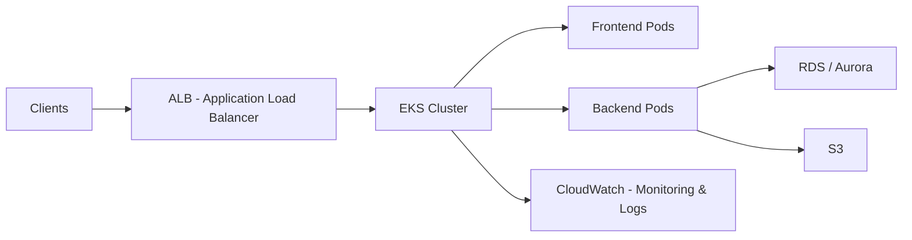

# Amazon EKS

---

## 1. What is Amazon EKS?

Amazon EKS is a **fully managed Kubernetes service** in AWS.

* Kubernetes = open-source system for  **container orchestration** .
* EKS allows you to  **run Kubernetes clusters without managing control plane infrastructure** .
* Scales and manages the Kubernetes master nodes automatically.

Think of EKS as  **AWS handling the hard parts of Kubernetes** , so you can focus on running containers.

---

## 2. Core Concepts

### 🔹 a) Kubernetes Cluster

* A **cluster** consists of:
  * **Control Plane** → managed by EKS, handles API requests, scheduling, and cluster management.
  * **Worker Nodes** → EC2 or Fargate instances where your containers run.
* EKS ensures **high availability** by running control plane nodes across multiple AZs.

---

### 🔹 b) Pods

* **Pods** = smallest deployable units in Kubernetes.
* Contain  **one or more containers** .
* Example: A microservice container running your frontend app inside a pod.

---

### 🔹 c) Services

* Expose your pods to the network.
* Types:
  * **ClusterIP** → internal only.
  * **NodePort** → exposes pod on a node’s port.
  * **LoadBalancer** → creates AWS ELB for external access.

---

### 🔹 d) Deployments

* Define **desired state** for pods (replicas, updates, rollbacks).
* EKS ensures the  **actual state matches the desired state** .

---

### 🔹 e) Namespaces

* Logical separation of resources within a cluster.
* Example: `dev`, `staging`, `prod` environments in one cluster.

---

### 🔹 f) ConfigMaps & Secrets

* **ConfigMaps** → store non-sensitive config.
* **Secrets** → store sensitive info (passwords, API keys).
* Both can be mounted into pods as environment variables or files.

---

## 3. Worker Nodes

### 🔹 Options

1. **EC2 Instances** (managed node groups)
   * You choose instance type, size, and scaling.
2. **Fargate**
   * Serverless → no nodes to manage.
   * Pay per pod runtime.
3. **Spot Instances**
   * Cost-effective option for non-critical workloads.

### 🔹 Node Autoscaling

* **Cluster Autoscaler** → adds/removes nodes based on pod resource demands.
* **Horizontal Pod Autoscaler (HPA)** → scales pods based on CPU/memory or custom metrics.

---

## 4. Networking in EKS

* Uses **Amazon VPC** for pod networking.
* **CNI plugin** → pods get private IPs inside the VPC.
* Can integrate with:
  * **ALB Ingress Controller** → route HTTP(S) traffic to pods.
  * **NLB (Network Load Balancer)** → TCP/UDP traffic routing.

---

## 5. Storage in EKS

* **Persistent Volumes (PV)** → persistent storage for pods.
* **Amazon EBS** → block storage for stateful workloads.
* **Amazon EFS** → network file storage for shared volumes.
* **S3** → external object storage.

---

## 6. Security in EKS

* **IAM Roles for Service Accounts (IRSA)** → pods can have  **fine-grained AWS permissions** .
* **Kubernetes RBAC** → control access to cluster resources.
* **Secrets encryption** → sensitive data encrypted at rest using KMS.
* **VPC security groups & network policies** → control network access.

---

## 7. CI/CD and EKS

* EKS is commonly used with  **CI/CD pipelines** :
  * Code commits → build Docker images → push to **ECR** (Elastic Container Registry) → deploy to **EKS** using Kubernetes manifests or Helm charts.
* Tools:
  * **AWS CodePipeline / CodeBuild**
  * **Jenkins / GitHub Actions**
  * **Helm** → package and manage Kubernetes apps.

---

## 8. Logging & Monitoring

* **CloudWatch Container Insights** → metrics, logs, and dashboards for EKS clusters.
* **Prometheus + Grafana** → advanced monitoring.
* **Fluent Bit / Fluentd** → collect logs from pods and forward to CloudWatch, S3, or OpenSearch.

---

## 9. Example Architecture: Web Application on EKS

```rust
Clients --> ALB --> EKS Cluster (Pods: Frontend, Backend)
Backend Pods --> RDS/Aurora (Database)
Backend Pods --> S3 (File Storage)
Pods --> CloudWatch (Monitoring)
```

* Frontend and backend run in  **separate pods** .
* ALB routes traffic to the correct service.
* Pods store files in S3, fetch data from RDS.
* CloudWatch monitors pod health and logs.

---

## 10. Real-World Use Cases

1. **Microservices Applications**
   * Deploy multiple services (frontend, backend, APIs) in containers.
2. **Data Processing**
   * Run Spark, Flink, or ML workloads in containerized pods.
3. **CI/CD Deployments**
   * Automated deployment pipelines using GitHub Actions, Jenkins, or AWS CodePipeline.
4. **Hybrid Workloads**
   * Combine Fargate for serverless pods + EC2 for high-performance workloads.

---

## 11. Advantages of EKS

✅ Fully managed control plane → no Kubernetes maintenance overhead.

✅ Integrates with  **AWS services** : IAM, CloudWatch, VPC, ECR, RDS, S3.

✅ Scalable → HPA, Cluster Autoscaler, managed node groups.

✅ Secure → IAM, RBAC, KMS encryption, VPC networking.

✅ Flexible → EC2, Fargate, Spot Instances.

---

## 12. Interview-Level Summary

If asked  **“What is Amazon EKS?”** :

> Amazon EKS is AWS’s **fully managed Kubernetes service** that allows you to deploy, manage, and scale containerized applications. The control plane is fully managed by AWS, while worker nodes can run on EC2, Fargate, or Spot Instances. EKS integrates with AWS services like IAM, VPC, CloudWatch, RDS, and S3 for security, networking, and storage. It supports  **microservices architectures** , CI/CD pipelines, and auto-scaling. Security is enforced via  **IAM, RBAC, KMS, and network policies** , making it suitable for production-grade workloads.

---

## 13. Example Mermaid Diagram


