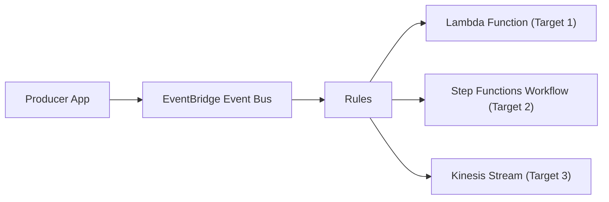

# **Amazon EventBridge**

---

## 1. **What is Amazon EventBridge?**

* **Definition** :

  Amazon EventBridge is a **serverless event bus** service that makes it easy to connect applications using events. It lets you route events between AWS services, SaaS apps, and your custom apps without writing complex integration code.
* **Think of it like** :

  A **central nervous system** for your applications, where different parts of your system can publish and react to events asynchronously.
* **Difference from SNS/SQS** :
* **SNS** : Pub/Sub messaging, fire-and-forget, doesn’t filter much, often paired with SQS.
* **EventBridge** : Rich filtering, schema validation, routing to multiple targets, native integration with AWS & SaaS.
* **SQS** : Queue with guaranteed delivery, decoupling producer/consumer.
* **EventBridge** is  **higher-level** , designed for complex  **event-driven architectures** , not just messaging.

---

## 2. **Core Concepts**

1. **Event Bus**
   * The central channel where events are sent.
   * Three types:
     * **Default Event Bus** : Provided automatically for AWS service events.
     * **Custom Event Bus** : For your own apps to publish custom events.
     * **Partner Event Bus** : For SaaS providers like Zendesk, Shopify, etc.
2. **Events**
   * JSON objects describing a change or action.
   * Example:
     ```json
     {
       "source": "myapp.orders",
       "detail-type": "orderCreated",
       "detail": {
         "orderId": "12345",
         "customerId": "67890",
         "amount": 250.0
       }
     }
     ```
   * Fields:
     * `source` → origin of the event.
     * `detail-type` → kind of event.
     * `detail` → the payload/data.
3. **Rules**
   * Define how events are filtered and routed.
   * Example: Route only `orderCreated` events from `myapp.orders` to a Lambda.
4. **Targets**
   * The destination for events.
   * Examples: Lambda, SQS, SNS, Step Functions, API Gateway, Kinesis, EC2, and many more.

---

## 3. **Key Features**

* **Event Filtering** :

  Instead of all subscribers getting all events (like SNS), EventBridge lets you **filter** based on JSON fields.

  Example: Only trigger Lambda if `amount > 100`.
* **Schema Registry** :

  Automatically discovers schemas (event structures) and saves them so devs know the event format.
* **Replay Events** :

  Capture and replay past events to test or reprocess them.
* **Cross-Account Event Routing** :

  Share events across AWS accounts and even across regions.
* **Integrations** :
* 200+ AWS services (Lambda, SQS, SNS, Step Functions, etc.).
* 3rd party SaaS apps (Shopify, Auth0, Datadog, etc.).

---

## 4. **Common Use Cases**

1. **Application Integration**
   * Microservices can communicate via events without direct coupling.
   * Example: `orderCreated` event → triggers billing microservice → triggers shipping microservice.
2. **Audit & Compliance**
   * Capture **AWS service events** (like EC2 instance launched, IAM user created) and route to security monitoring.
3. **Real-Time Analytics**
   * Events go to Kinesis or Firehose → real-time dashboards.
4. **Automated Workflows**
   * Example: New S3 file uploaded → EventBridge → Step Functions workflow → Data ETL → Notify via Slack.
5. **SaaS Integrations**
   * E.g., a Zendesk ticket update can trigger your internal AWS workflow automatically.

---

## 5. **Comparison with SNS/SQS**

| Feature                    | SNS               | SQS                  | EventBridge             |
| -------------------------- | ----------------- | -------------------- | ----------------------- |
| Type                       | Pub/Sub messaging | Message Queue        | Event Router/Event Bus  |
| Filtering                  | Limited (topics)  | None                 | Advanced JSON filtering |
| Schema                     | None              | None                 | Schema registry         |
| Fan-out (multiple targets) | Yes               | 1 consumer per queue | Yes, many targets       |
| Replay                     | No                | Yes (with DLQ, FIFO) | Yes, built-in           |
| Integrates with SaaS       | No                | No                   | Yes                     |

👉  **Rule of thumb** :

* Use **SQS** if you need **guaranteed ordered delivery** and message retention.
* Use **SNS** if you just need  **simple pub/sub** .
* Use **EventBridge** if you need  **smart event routing, filtering, and SaaS/AWS integration** .

---

## 6. **Example Architecture**

 **Scenario** : E-commerce platform

* `orderCreated` event goes into  **Custom Event Bus** .
* Rules:
  * If `amount > 500` → send event to fraud detection Lambda.
  * If `amount < 500` → send event to billing Lambda.
* Another rule → all orders get sent to a Data Lake via Kinesis for analytics.

Diagram (mental model):



---

## 7. **Best Practices**

* Keep events **lightweight** (payload < 256 KB).
* Use **detail-type and source** consistently for clean filtering.
* Use **Schema Registry** to enforce contracts between producers and consumers.
* If you need  **ordering and guaranteed delivery** , combine EventBridge with  **SQS FIFO** .
* Use **dead-letter queues** (DLQs) to capture undelivered events.
* For  **multi-account orgs** , centralize with cross-account event buses.

---

## 8. **Interview-Level Talking Points**

* EventBridge is AWS’s evolution of CloudWatch Events (old service).
* Designed for  **event-driven microservices** , improves agility and reduces coupling.
* Strong use cases:  **automation, SaaS integration, cross-account governance** .
* Compared to SNS/SQS, EventBridge offers  **advanced filtering, schema validation, replay, SaaS integrations** .
* In practice, you often **combine** them: EventBridge routes → SQS queue for durable processing.
