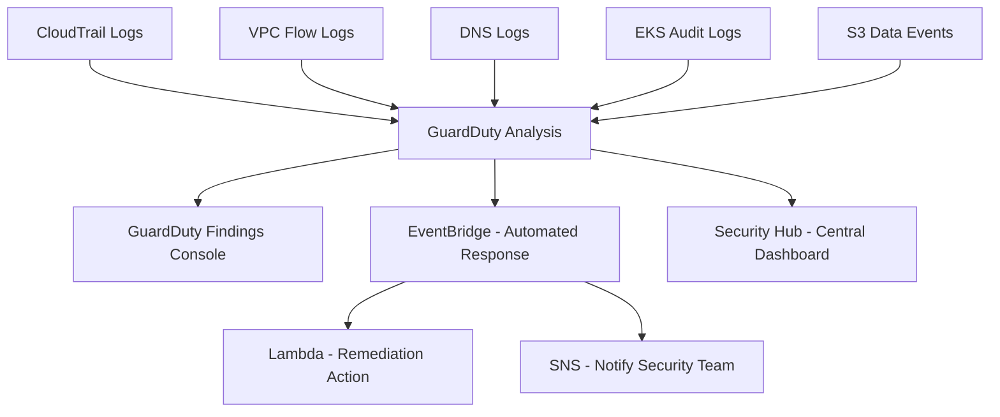

# Amazon GuardDuty

---

## 1. **What is GuardDuty?**

Amazon GuardDuty is a  **threat detection and continuous monitoring service** .

It uses:

* **Machine learning (ML)**
* **Anomaly detection**
* **Threat intelligence feeds** (from AWS + external sources)

to detect **malicious or unauthorized behavior** in your AWS environment.

✅ Think of it as your AWS  **intrusion detection system (IDS)** .

It doesn’t block traffic (that’s WAF/Firewall’s job) — it **finds suspicious activity** and raises findings.

---

## 2. **Data Sources GuardDuty Analyzes**

GuardDuty continuously consumes data from:

* **AWS CloudTrail logs**
  * API activity & user behavior
  * Example: Detects if IAM user is trying to escalate privileges.
* **VPC Flow Logs**
  * Network traffic metadata
  * Example: Detects unusual outbound traffic to a malicious IP.
* **DNS Logs**
  * Domain name lookups
  * Example: Detects connections to domains associated with malware.
* **EKS Audit Logs** (Kubernetes)
  * Detects suspicious activity inside clusters.
* **S3 Data Events**
  * Detects anomalies like unusual `GetObject` requests.

---

## 3. **How GuardDuty Works**

1. **Ingests log data** (CloudTrail, VPC Flow Logs, DNS, etc.).
2. **Applies ML and threat intel** to detect suspicious patterns.
3. **Generates findings** (alerts) if threats are detected.
4. Findings are displayed in the **GuardDuty console** and can be sent to:
   * **CloudWatch Events/EventBridge** (for automated response).
   * **SNS** (to notify security team).
   * **Security Hub** (centralized security dashboard).

---

## 4. **Examples of Threats Detected**

* **IAM-related anomalies**
  * Root account used without MFA.
  * Privilege escalation attempts.
  * Unusual API calls from a new region.
* **Network anomalies**
  * EC2 instance communicating with known botnet C&C servers.
  * Port scanning or brute-force attacks.
* **S3 anomalies**
  * Unusual data access (sudden massive downloads).
  * Access from suspicious locations.
* **EKS anomalies**
  * Pods communicating with malicious IPs.
  * API server access anomalies.

---

## 5. **Severity Levels**

Each finding is categorized into:

* **Low** → Suspicious, but not necessarily malicious (e.g., unusual login location).
* **Medium** → Needs investigation (e.g., EC2 contacting a suspicious IP).
* **High** → Active compromise (e.g., IAM credentials used by attacker).

---

## 6. **Best Practices**

✅ **Enable GuardDuty across all accounts & regions** (use AWS Organizations).

✅ **Integrate with EventBridge** to automate responses:

* Disable compromised IAM user.
* Isolate EC2 with NACL or security group.

  ✅ **Feed findings into Security Hub** for centralized visibility.

  ✅ **Enable GuardDuty S3 Protection** if dealing with sensitive data (financial/medical).

  ✅ **Regularly review findings** and tune IAM/Security Groups accordingly.

---

## 7. **Use Case Example: Financial / Insurance System**

Imagine you’re running an  **insurance claims system** :

* GuardDuty detects an **IAM user** trying to access S3 claim files from Russia (never seen before).
* Generates a  **high-severity finding** .
* EventBridge triggers a **Lambda function** to:
  * Disable IAM user credentials.
  * Notify security team via SNS.
* Security team reviews CloudTrail logs and confirms compromise.

---

## 8. **Architecture Flow**



---

## 9. **Example GuardDuty Finding (JSON Snippet)**

```json
{
  "schemaVersion": "2.0",
  "accountId": "123456789012",
  "region": "us-east-1",
  "type": "UnauthorizedAccess:IAMUser/ConsoleLogin",
  "severity": 8.0,
  "title": "Unauthorized IAM login attempt detected",
  "description": "An IAM user attempted to log in from an unusual IP address",
  "resource": {
    "resourceType": "AccessKey",
    "instanceDetails": null
  },
  "service": {
    "serviceName": "guardduty",
    "detectorId": "12abc34d567e8f9012g3h4567i890jkl",
    "action": {
      "actionType": "AWSConsoleSignIn",
      "awsApiCallAction": {
        "api": "ConsoleLogin",
        "serviceName": "signin.amazonaws.com",
        "callerType": "Remote IP"
      }
    }
  }
}

```

---

## 10. **Interview Talking Points**

* GuardDuty = **threat detection service** for AWS.
* Analyzes  **CloudTrail, VPC Flow, DNS, S3, and EKS logs** .
* Detects  **anomalies and malicious activity** .
* Integrates with **EventBridge, Security Hub, SNS, Lambda** for response.
* Key for  **financial/healthcare PII protection** .
* Works across **multi-account environments** with AWS Organizations.

---

✅ Bottom line:

**CloudTrail** → Audit logs (“who did what”)

**CloudWatch** → Monitoring (“how is it running”)

**GuardDuty** → Security threat detection (“is it safe?”)
