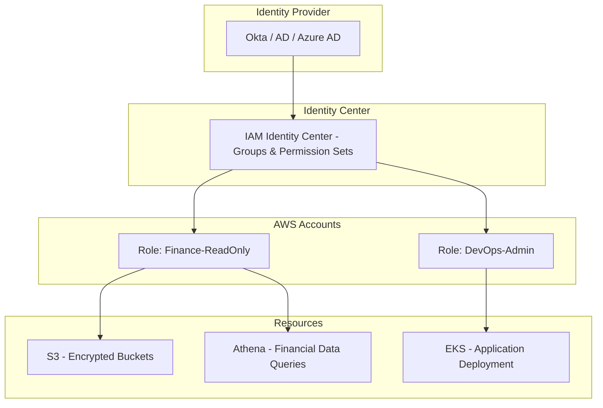

# AWS IAM & IAM Identity Center (formerly AWS SSO)

---

## 1. What is IAM?

**AWS Identity and Access Management (IAM)** is the **foundational service for controlling access** to AWS resources.

* It defines  **who can do what, on which resources** .
* It’s the engine behind  **least privilege security** .

### Core IAM Concepts

1. **Principals** (who is making the request):
   * Users, roles, or services.
2. **Policies** (what actions are allowed/denied):
   * JSON documents attached to principals.
3. **Permissions**
   * Example: `s3:GetObject` for a specific bucket.
4. **Roles**
   * Identities with temporary credentials, often assumed by applications, services, or federated users.
5. **Groups**
   * Logical collections of users (e.g., DevOps, Finance Analysts).

👉 Think of IAM as the **blueprint for access control** within AWS.

---

## 2. What is IAM Identity Center (formerly AWS SSO)?

IAM Identity Center is the **workforce identity management solution** for AWS.

It provides **single sign-on (SSO)** for AWS accounts and business applications.

* Integrates with **Active Directory, Okta, Azure AD, etc.**
* Provides  **centralized user/group management** .
* Assigns **permission sets** to users and groups → which map to IAM roles in AWS accounts.

👉 Think of it as the **entry point for human users** into AWS, while IAM handles  **low-level permissions enforcement** .

---

## 3. How They Work Together

* **IAM controls the low-level access** (policies, roles, permissions).
* **IAM Identity Center simplifies user access** by centralizing sign-on and mapping users to IAM roles.

### Example Flow

1. A **financial analyst** logs in using their corporate credentials.
2. Identity Center maps them to a **group** called “Finance-ReadOnly.”
3. The group has a **permission set** → which assumes an IAM role → that only allows `Athena:Select` and `S3:GetObject` in a specific data lake.
4. The analyst sees only the dashboards they need — no ability to delete data.

---

## 4. IAM Deep Dive

### Key Features

1. **Policies**
   * Inline or managed JSON documents.
   * Example:
     ```json
     {
       "Version": "2012-10-17",
       "Statement": [
         {
           "Effect": "Allow",
           "Action": "s3:GetObject",
           "Resource": "arn:aws:s3:::finance-data/*"
         }
       ]
     }
     ```
2. **Roles**
   * Used by services (like Lambda accessing DynamoDB).
   * Used by **federated users** (SSO, Cognito, Identity Center).
3. **Temporary Credentials**
   * Roles issue short-lived tokens via STS.
   * Reduces risk of credential leakage.
4. **IAM Access Analyzer**
   * Detects overly broad permissions (e.g., “public S3 bucket”).

---

## 5. IAM Identity Center Deep Dive

### Core Concepts

1. **Users and Groups**
   * Can be stored in AWS or synced from an external IdP (Active Directory, Okta, Azure AD).
2. **Permission Sets**
   * Define what actions users can perform in AWS accounts.
   * Example: “Data Engineer” permission set → Assume role with S3 + Glue + Athena permissions.
3. **Account Assignments**
   * Map users/groups → permission sets → AWS accounts.
4. **App Integration**
   * Can also be used for SaaS apps (Salesforce, Microsoft 365, Jira).

---

## 6. Use Cases

### 🏦 Financial Services (PII & transactions)

* **IAM** :
* Define fine-grained access to S3 buckets (`s3:GetObject` only for billing analysts).
* Restrict Lambda function roles so only transaction-processing functions can access RDS.
* **Identity Center** :
* Finance team logs in with corporate SSO.
* Analysts get read-only permissions, auditors get full logs, but no one can write.

### 🏥 Healthcare (PHI / HIPAA)

* **IAM** :
* Doctors can only view their patients’ records (row-level security enforced at app layer + IAM).
* Developers have no access to production PHI datasets.
* **Identity Center** :
* Doctors authenticate via hospital directory → mapped to “Doctor” group.
* Permission set only allows access to  **QuickSight dashboards** , not raw patient data.

---

## 7. Security Best Practices

1. **Principle of Least Privilege**
   * Always start with `Deny` → add only what’s necessary.
2. **Separation of Duties**
   * Developers vs Finance vs Security admins → different roles.
3. **Use IAM Roles Instead of IAM Users**
   * For applications and workloads, roles are safer (temporary creds).
4. **Enable MFA Everywhere**
   * Especially for Identity Center logins.
5. **Audit with CloudTrail**
   * Track who assumed which role and when.
6. **Rotate Keys Automatically**
   * For CMKs and any long-term credentials (though ideally no long-term creds at all).

---

## 8. IAM vs IAM Identity Center (Comparison Table)

| Feature                   | IAM                                                     | IAM Identity Center (SSO)                     |
| ------------------------- | ------------------------------------------------------- | --------------------------------------------- |
| **Scope**           | Resource-level access control                           | Workforce identity + SSO                      |
| **Who**             | AWS users, roles, services                              | Human users/groups (workforce)                |
| **Policies**        | JSON IAM policies                                       | Permission Sets (map to IAM roles)            |
| **Best Use**        | Service-to-service auth, fine-grained control           | Centralized login for employees               |
| **Integration**     | Direct with AWS resources                               | Works with corporate IdP (AD, Okta, Azure AD) |
| **Credential Type** | Long-term users (not recommended) or roles (STS tokens) | Temporary SSO sessions mapped to IAM roles    |

---

## 9. Example Architecture: Secure Access Flow



---

## ✅ Summary

* **IAM** = fine-grained access control for AWS services.
* **Identity Center** = centralized login & workforce access → assigns groups to IAM roles.
* Both follow the  **least privilege principle** .
* Use  **IAM roles for workloads** ,  **Identity Center for people** .
* Critical for **finance & healthcare systems** because it enforces compliance and prevents over-privileged access.
