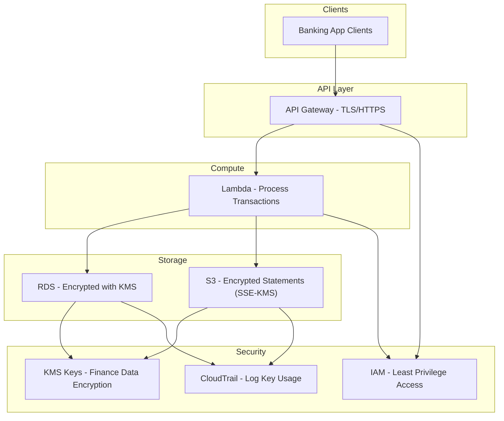

# 🔑 AWS Key Management Service (KMS)

---

## 1. What is AWS KMS?

AWS **Key Management Service (KMS)** is a fully managed service that lets you **create, manage, and control cryptographic keys** used to encrypt and decrypt data.

* KMS provides **centralized control** of encryption.
* It integrates with almost every AWS service (S3, RDS, DynamoDB, Lambda, EBS, CloudTrail, etc.).
* It helps you meet **compliance requirements** (PCI DSS, HIPAA, GDPR).

---

## 2. Key Concepts

### 🔹 Customer Master Key (CMK) / KMS Key

* **Now just called KMS Keys** (used to be CMK).
* A logical representation of a key that AWS uses to encrypt/decrypt.
* Stored in AWS KMS (not exposed).

### 🔹 Types of Keys

1. **AWS-managed keys (aws/service-name)**
   * Created automatically when you enable encryption on a service (e.g., `aws/s3`).
   * AWS rotates them automatically every 3 years.
   * Minimal management overhead.
2. **Customer-managed keys (CMKs)**
   * You create & fully control.
   * Can enable automatic  **key rotation (every year)** .
   * Define **IAM policies + key policies** for fine-grained access.
   * Needed when compliance requires  **explicit control** .
3. **Data Keys**
   * Actual encryption happens with  **data keys** , not the KMS key itself.
   * AWS uses an  **envelope encryption model** :
     * A **KMS key** encrypts the  **data key** ,
     * The data key encrypts the actual data.

---

## 3. How KMS Encryption Works (Envelope Encryption)

1. Your app asks KMS for a **data key** (API call).
2. KMS generates:
   * A **plaintext data key** (used for encryption in your app).
   * An **encrypted data key** (wrapped with your KMS key).
3. Your app uses the **plaintext key** to encrypt the data (locally).
4. App discards plaintext key, but stores the **encrypted data key** alongside the data.
5. Later, when you need to decrypt, you send the encrypted data key to KMS → KMS decrypts it → you get the plaintext data key → decrypt your data.

👉 This ensures your sensitive  **KMS key never leaves AWS KMS** .

---

## 4. Use Cases

### 🔹 Financial Example

* Encrypting **credit card transactions** stored in  **Amazon RDS** .
* Each record encrypted with a  **data key** , data key wrapped by a  **KMS key** .

### 🔹 Medical Example

* Encrypting **patient scans** in  **S3 (SSE-KMS)** .
* Each file encrypted with a unique key → access only with IAM permissions + key policy.

### 🔹 Other Common Use Cases

* Encrypting **logs** in CloudTrail.
* Securing **EBS volumes** for EC2.
* Encrypting **API payloads** before sending over the wire.
* Signing documents or digital signatures.

---

## 5. Access Control

### Key Policies

* JSON-based policies directly attached to the key.
* Define **who can use** the key (IAM roles/users).
* Example: Only the “PaymentsServiceRole” can use `KMS:Decrypt` on the finance key.

### Grants

* Temporary permissions to allow other AWS accounts or services to use your key.

### IAM + Key Policy Together

* A request to use KMS must pass  **both IAM policy + key policy** .

👉 **Best Practice:** Use **least privilege** — only allow `Encrypt/Decrypt` to services that absolutely need it.

---

## 6. KMS Security Best Practices

1. **Separate Keys for Different Data Types**
   * One key for financial transactions, another for medical records.
2. **Enable Key Rotation**
   * Customer-managed keys can auto-rotate every 365 days.
3. **Use Aliases**
   * Instead of hardcoding `key-id`, use aliases like `alias/finance-key`.
4. **Audit with CloudTrail**
   * Every use of a KMS key (encrypt/decrypt) is logged in CloudTrail.
5. **Combine with IAM**
   * Limit `KMS:Decrypt` permissions only to services that must read sensitive data.
6. **Multi-Region Keys**
   * If your app spans multiple regions, you can replicate keys across regions.

---

## 7. Example Architecture (Financial System with PII)

---

## ✅ Summary

* **AWS KMS = Centralized encryption service.**
* Uses **envelope encryption** with KMS keys + data keys.
* **Two types of keys** : AWS-managed vs customer-managed.
* **Integrates with almost all AWS services** (S3, RDS, DynamoDB, EBS, CloudTrail).
* **Best Practices** : least privilege, key rotation, separate keys for sensitive domains, audit key usage with CloudTrail.

👉 In **finance** or  **healthcare** , KMS ensures data stays encrypted, controlled, and auditable.
