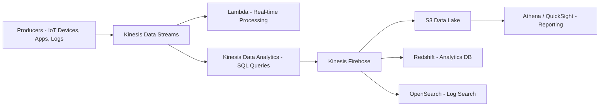

# Amazon Kinesis

---

## 1. Introduction to Kinesis

### What is Amazon Kinesis?

Amazon Kinesis is a **real-time data streaming service** in AWS.

It allows you to  **collect, process, and analyze large streams of data in real time** .

* Handles **gigabytes per second** of incoming data.
* Designed for **low-latency use cases** → e.g., monitoring, analytics, IoT, log processing, clickstreams.
* Alternative to batch ETL → instead of waiting minutes or hours, you process data within  **seconds** .

### Why Kinesis Exists

Traditionally:

* Data gets written to logs → processed in batches → loaded into databases.
* Problem: Batch =  **delay** .
* Kinesis: Provides **streaming pipelines** so apps get insights instantly.

---

## 2. Core Kinesis Services (The “Family”)

Kinesis is not one product — it’s a **suite** of four main services:

1. **Kinesis Data Streams (KDS)**
   * Core service for ingesting real-time data.
   * Example: Collecting clickstream events, sensor data, or logs.
2. **Kinesis Data Firehose**
   * Managed service to load streaming data into destinations (S3, Redshift, OpenSearch, Splunk).
   * **No coding needed** → AWS handles buffering, transformation, retries.
3. **Kinesis Data Analytics**
   * Run SQL queries on streaming data in real time.
   * Example: “SELECT COUNT(*) FROM stream WHERE value > 100 GROUP BY 1 minute”.
4. **Kinesis Video Streams**
   * Specialized for streaming video/audio.
   * Example: IoT cameras, video analytics, machine learning.

---

## 3. Kinesis Data Streams (KDS)

### Key Concepts

* **Shard** →

  * Think of a shard as a  **lane in a highway** —each shard can handle a certain amount of traffic (data), and if you need more throughput, you add more lanes (shards).
  * **Capacity per shard** :

    * **Write capacity** : Up to **1 MB per second OR 1,000 records per second** (whichever comes first).
    * **Read capacity** : Up to **2 MB OR 1,000 records per second** (across all consumers).
  * **Scaling** :

    * A stream starts with one or more shards.
    * If your traffic increases, you can **split shards** (adding more lanes).
    * If your traffic decreases, you can **merge shards** (fewer lanes to save cost).
  * **Data routing** :

    * Each record you put into Kinesis has a  **partition key** .
    * Kinesis uses that partition key to map the record into a specific shard.
  * **Retention** :

    * Records stay in a shard for the stream’s **retention period** (default 24 hours, extendable to 7 days or more with extended retention).
* **Producer** →

  * Anything that **writes data into the stream**
  * Source app that pushes events
    * (IoT device, web app, logs).
* **Consumer** →

  * Apps/services that **reads data from the stream**
    * (Lambda, KCL app, analytics tools).
* **Retention** → Default 24 hrs, up to 7 days (or 365 with extended retention).

### Data Flow

```
Producers → Kinesis Data Stream → Shards → Consumers
```

### Example

* A **trading platform** sends stock trades into Kinesis.
* A **Lambda function** consumes the stream, processes trades, and stores into DynamoDB for dashboards.

---

## 4. Kinesis Data Firehose

### Key Concepts

* Fully **managed ingestion + delivery** service.
* No shard management, no manual scaling → AWS auto-scales.
* Can buffer (by time or size) before delivering.
* Supports **data transformation** with Lambda (e.g., JSON → Parquet).

### Destinations

* **S3** (data lake).
* **Redshift** (analytics DB).
* **OpenSearch** (search + log analytics).
* **Splunk, Datadog** (3rd party).

### Example

* An **insurance company** streams claim logs.
* Firehose buffers → transforms with Lambda → delivers to **S3** for Glue + Athena reporting.

---

## 5. Kinesis Data Analytics

### Key Concepts

* Run **real-time SQL queries** on streaming data.
* Use case: Detect anomalies, aggregate metrics, transform streams.
* Integrates with **Data Streams** and  **Firehose** .

### Example

* Monitor IoT temperature data.
* Query:
  ```sql
  SELECT AVG(temp) 
  FROM stream 
  GROUP BY TUMBLINGWINDOW(minute, 5)
  ```
* Sends results downstream to  **Firehose → Redshift** .

---

## 6. Deep Dive: Kinesis Video Streams

### Key Concepts

* Capture live video/audio streams.
* Store encrypted in AWS.
* Integrates with **Rekognition** for ML-based video analysis (e.g., facial recognition).

### Example

* A **retail store** streams CCTV video into Kinesis Video.
* A Rekognition app detects suspicious activity in real time.

---

## 7. Kinesis + Other AWS Services (Integrations)

Kinesis usually isn’t used alone. Common integrations:

* **Lambda** → Triggered by streams for real-time processing.
* **S3** → Long-term storage (via Firehose).
* **Athena** → Query processed streaming data.
* **Glue** → ETL pipelines for structured data.
* **QuickSight** → BI dashboards from streaming data.
* **Redshift** → Warehousing and analytics.
* **OpenSearch** → Log indexing + visualization.

---

## CloudWatch Metrics

1. `IteratorAgeMilliseconds`

   * shows **how far behind your consumer is** from the latest record in the stream.
   * If it’s **low (near zero)** → your Lambda (or other consumer) is keeping up.
   * If it starts to **rise** → your consumer is lagging and there’s backpressure (records waiting to be processed).

   👉 In simple words:

   It’s the **delay, in milliseconds, between the newest record in the shard and the record your consumer is currently processing.**
2. 

---

## Real-World Use Cases

### 📊 Financial Services

* Real-time fraud detection.
* Stream credit card transactions → ML model via Lambda → detect anomalies → alert system.

### 🏥 Healthcare

* IoT medical devices stream patient vitals → Kinesis Data Streams → Data Analytics detects abnormalities → triggers alarms.

### 🛒 Retail / E-commerce

* Track customer clickstreams → analyze buying patterns → recommend products instantly.

### ☎ Call Centers

* Stream call logs from Amazon Connect into Kinesis → transform → store in S3 → Athena + QuickSight dashboards.

---

## 9. Security in Kinesis

* **Encryption** :
  * Data at rest → encrypted with  **KMS** .
  * Data in transit → TLS.
* **IAM** : Fine-grained policies for producers and consumers.
* **VPC Endpoints** : Keep traffic private.
* **CloudTrail** : Monitor API calls.

---

## 10. Pricing

* **Data Streams** : Pay per shard-hour + PUT payload units.
* **Firehose** : Pay per GB ingested and delivered.
* **Data Analytics** : Pay for running apps and processing units.
* **Video Streams** : Pay per GB ingested + storage + data retrieval.

---

## 11. Example Pipeline Diagram



---

## 12. Interview-Level Summary

If asked  **“What is Kinesis and how would you use it?”** :

> Amazon Kinesis is AWS’s suite of  **real-time data streaming services** . It includes **Kinesis Data Streams** for custom real-time apps, **Firehose** for managed delivery into S3/Redshift/OpenSearch, **Data Analytics** for SQL queries on live data, and **Video Streams** for video/audio processing. It’s used in financial, healthcare, and retail industries for  **fraud detection, IoT monitoring, clickstream analysis, and real-time reporting** . Kinesis integrates with services like **Lambda, S3, Glue, Athena, and QuickSight** to create end-to-end streaming data pipelines. Security is enforced with  **KMS encryption, IAM least privilege, and VPC endpoints** .
>
