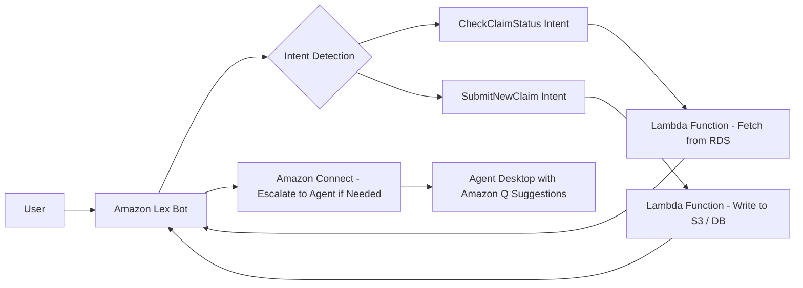

# Amazon Lex

---

## 1. What is Amazon Lex?

Amazon Lex is a **fully managed service for building conversational interfaces** using  **voice and text** .

* Powers **chatbots** and  **virtual assistants** .
* Uses **automatic speech recognition (ASR)** and  **natural language understanding (NLU)** .
* Integrates natively with  **Amazon Connect, Lambda, and Q** , making it ideal for  **contact centers** .

Think of Lex as the **AI brain** behind your chatbots.

---

## 2. Core Concepts

### 🔹 a) Bot

* The main container for your conversational logic.
* Can be **voice-enabled** or  **text-only** .
* Example: `InsuranceClaimsBot` answers questions about claims, policy status, or payments.

---

### 🔹 b) Intent

* Represents  **what the user wants to do** .
* Example intents for an insurance bot:
  * `CheckClaimStatus`
  * `SubmitNewClaim`
  * `GetPolicyInfo`

Each intent has:

* **Sample utterances** → phrases users might say (e.g., “What’s my claim status?”).
* **Slots** → variables that the bot collects from the user (e.g., `ClaimNumber`, `DateOfLoss`).
* **Fulfillment** → action taken after collecting all slots (e.g., call a Lambda function to fetch claim data).

---

### 🔹 c) Slots

* Parameters or information the bot collects to fulfill an intent.
* Can be:
  * Required or optional.
  * With **types** (string, date, number, custom values).
* Example: For `CheckClaimStatus`, a slot could be `ClaimNumber` (type: string).

---

### 🔹 d) Utterances

* Example phrases users say to invoke an intent.
* Lex uses **NLU** to map utterances to intents.
* Example: `"Check my claim"`, `"Status of claim 12345"` → `CheckClaimStatus` intent.

---

### 🔹 e) Fulfillment

* What the bot does after collecting required info:
  * **Return a response** to the user.
  * **Invoke a Lambda function** → process data, update DB, or trigger workflows.
* Example: Lambda fetches claim status from **RDS or DynamoDB** and returns to the user.

---

### 🔹 f) Error Handling / Validation

* Bots can handle:
  * Misunderstood utterances → ask user again.
  * Invalid slot values → prompt user to re-enter.

---

## 3. Lex + Amazon Connect Integration

* Lex powers  **self-service in Connect** :
  * IVR menu → Lex chatbot → resolve simple requests.
  * If escalated → route to agent.
* Combined with  **Amazon Q** , agents get suggested answers from knowledge bases.
* Lex can work with both **voice calls** and **chat messages** in Connect.

---

## 4. Lex + Lambda Integration

* Lambda functions are commonly used to:
  * Fetch data from databases (RDS, DynamoDB).
  * Write data to S3 or other systems.
  * Trigger workflows or microservices.
* Example:
  * User: “Check my claim status.”
  * Lex collects `ClaimNumber` slot.
  * Lambda function queries RDS → returns claim status → Lex responds to the user.

---

## 5. Lex + Bedrock / AI Integration

* Lex can integrate with **Amazon Bedrock** or other generative AI tools to:
  * Enhance chatbot responses.
  * Summarize or explain complex documents.
  * Provide citations or reference content from knowledge bases.
* Useful for advanced  **call center automation** .

---

## 6. Example Use Case: Insurance Company

**Scenario:** Customer wants claim status via website chat.

1. Customer opens chat → Lex bot activated.
2. Bot asks: “Please provide your claim number.”
3. User inputs claim number → Lex stores in slot.
4. Lex invokes Lambda → queries RDS for claim status.
5. Lambda returns status → Lex responds:

   `"Your claim #12345 is currently under review. Expected completion: Oct 10."`
6. If needed, Lex can escalate to a human agent in Connect.
7. All interactions logged in **Kinesis/S3** → QuickSight dashboards for analytics.

---

## 7. Security & Compliance

* **IAM Policies** control who can create, edit, or invoke bots.
* **Encryption** :
* Data at rest → KMS encryption.
* Data in transit → TLS.
* **PII handling** : Avoid storing sensitive data in raw format; use Lambda for masking.
* **Compliance** : Works in HIPAA, PCI DSS environments.

---

## 8. Lex Pricing

* **Text requests** : $0.004 per request.
* **Voice requests** : $0.0065 per request (includes speech-to-text and text-to-speech).
* No upfront fees — you pay per interaction.

---

## 9. Benefits of Lex

✅ Fully managed, no servers.

✅ Native AWS integration (Connect, Lambda, Q, Bedrock).

✅ Supports both  **voice and text** .

✅ Uses **NLU + slot filling** for complex conversations.

✅ Scalable for thousands of users.

✅ Can integrate into apps, websites, or contact centers easily.

---

## 10. Example Architecture Diagram

---

## 11. Interview-Level Summary

If asked  **“What is Amazon Lex?”** :

> Amazon Lex is AWS’s fully managed **conversational AI service** for building chatbots that work with  **voice and text** . It uses **automatic speech recognition (ASR)** and **natural language understanding (NLU)** to detect **intents** and fill  **slots** . Bots can integrate with **Lambda** for backend processing, **Amazon Connect** for contact center self-service, and **Amazon Q or Bedrock** for knowledge-based responses. Lex is fully managed, scalable, and supports secure handling of sensitive data, making it ideal for industries like  **finance and healthcare** .
>
