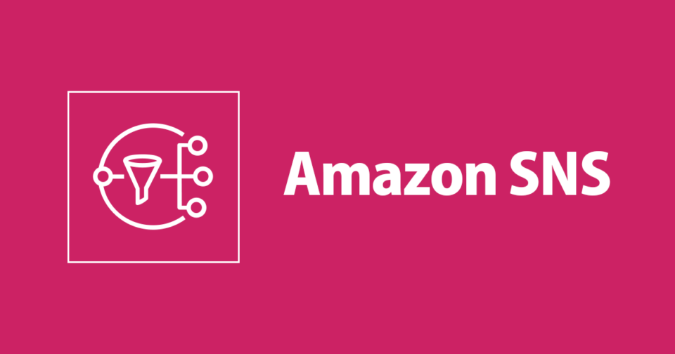

# Amazon SNS (Simple Notification Service)

---

## 1. **What is SNS?**

* Fully managed  **pub/sub messaging service** .
* Publishers send messages to an  **SNS topic** .
* Subscribers (endpoints like SQS, Lambda, HTTP, email, SMS, mobile push) receive those messages.
* Decouples producers from consumers.

👉 **Think of SNS as a “broadcast system” that fans messages out to many endpoints.**

---

## 2. **Core Concepts**

* **Topic** → Logical access point for messages.
* **Publisher** → Entity that sends messages to a topic.
* **Subscriber** → Endpoint that receives messages (SQS, Lambda, HTTP/S, SMS, email, Kinesis, etc.).
* **Message Delivery** → SNS pushes messages to subscribers.

---

## 3. **Message Delivery Models**

* **Fan-out (classic pattern):**
  * One message → multiple subscribers.
  * Example: Order event → billing system, analytics, customer notifications.
* **Direct-to-mobile / SMS / Email:**
  * Send push notifications to apps, texts, or alerts.
* **Event distribution:**
  * Trigger multiple downstream systems with a single event.

---

## 4. **Key Features**

* **Scalable:** Millions of subscribers and messages per second.
* **Durable:** Stores copies across AZs.
* **Flexible delivery protocols:** SQS, Lambda, Kinesis, HTTP/S, email, SMS, mobile push.
* **Message filtering:** Subscribers can apply filters (so they only get relevant messages).
* **Security:** IAM access control, message encryption (KMS), VPC endpoints.
* **Retry + DLQ integration:** Retries failed deliveries, can integrate with SQS for DLQs.

---

## 5. **SNS vs SQS**

* **SNS:** Push-based, fan-out, broadcast, many subscribers.
* **SQS:** Pull-based, point-to-point, one consumer at a time.
* Often  **combined** : SNS → multiple SQS queues → consumers poll their own queue independently.

👉 **Interview soundbite:**

*"SNS pushes, SQS pulls. I use SNS for broadcast, and SQS for reliable async processing. Often I combine them — SNS fan-out into multiple SQS queues for different microservices."*

---

## 6. **Common Integration Patterns**

* **Fan-out Messaging (SNS → SQS/Lambda):**
  * Publish once, multiple consumers process independently.
* **Alerting System:**
  * CloudWatch alarm → SNS → SMS + Email + PagerDuty.
* **Push Notifications:**
  * SNS → Mobile apps (APNS, FCM).
* **Workflow Triggering:**
  * New order → SNS → downstream processing via Lambda.

---

## 7. **Reliability & Message Handling**

* **Retries:** SNS retries failed deliveries (exponential backoff).
* **DLQ:** If delivery fails persistently, messages can be sent to SQS DLQ for later inspection.
* **Durability:** Messages stored across multiple AZs.
* **At-least-once delivery:** May result in duplicates. Consumers must be idempotent.

---

## 8. **Best Practices**

* **Use message filtering** → Reduce consumer workload.
* **Decouple with SQS** → For critical workloads, put SQS between SNS and consumers (ensures durability).
* **Idempotent consumers** → Handle duplicates gracefully.
* **Security** → Use IAM policies + topic policies to control who can publish/subscribe.
* **Encrypt messages** → KMS for data at rest, TLS for in-transit.

---

## 9. **Pitfalls & Solutions**

| Pitfall                                 | Solution                             |
| --------------------------------------- | ------------------------------------ |
| Lost messages if consumer is down       | Use SNS → SQS pattern               |
| Duplicate messages                      | Ensure idempotent consumers          |
| Unwanted subscribers receiving messages | Use message filtering + IAM policies |
| Limited throughput on mobile push/SMS   | Use batching + segmenting            |

---

## 10. **Example Architectures**

1. **E-commerce Order Processing (Fan-out):**
   * Order placed → SNS topic →
     * Billing microservice (SQS queue)
     * Inventory microservice (SQS queue)
     * Analytics microservice (Lambda)
     * Customer email notification (SES)
2. **Monitoring Alerts:**
   * CloudWatch alarm → SNS topic →
     * On-call engineer (SMS/email)
     * Incident management system (HTTP webhook)
     * Lambda function for auto-remediation
3. **Mobile Notifications:**
   * App event → SNS → Push notification to iOS (APNS) and Android (FCM).

---

## 11. **When NOT to Use SNS**

* When you need **long-term message persistence** (use SQS).
* When consumers **must poll at their own pace** (use SQS).
* For **highly ordered, exactly-once** workflows (use FIFO SQS or Step Functions).
* For **real-time analytics/streaming** (use Kinesis instead).
