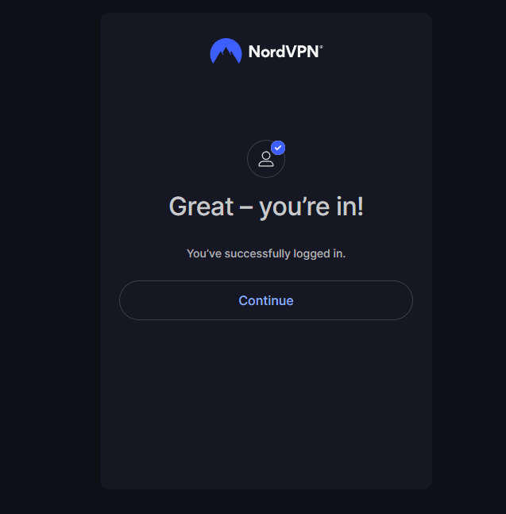

# Tips on using NordVpn on Linux

---

## Login Process

```powershell
nordvpn login
```

it will give you a url say in to go here to finish logging in

```powershell
Continue in the browser: https://api.nordvpn.com/v1/users/oauth/login-redirect?attempt=########-####-####-####-############
```

after going to the url to finish logining in you will get something like this:



right click on the Continue button and copy the link address
now go back to the terminal and enter this:

```powershell
nordvpn login --callback "nordvpn://login?action=login&exchange_token=<session token>%3D%3D&status=done"
```

 Note: Right after the callback inside the "" is where you paste the link address you copied from the continue button
