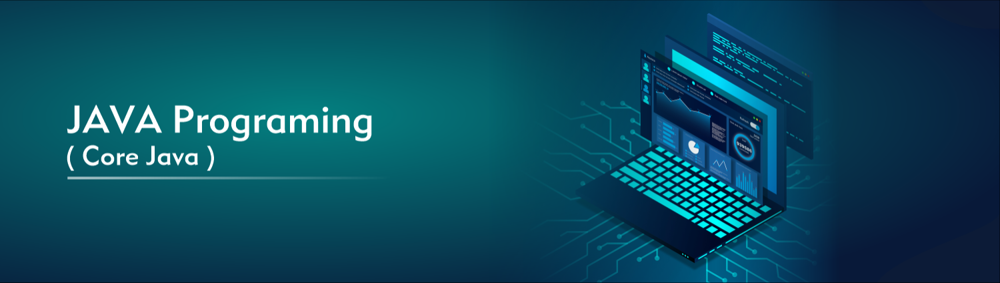

# Core Java Basics

* Java syntax (variables, data types, operators)
* Control flow (`if`, `switch`, loops)
* Methods (parameters, return values, overloading)
* Exception handling (`try`, `catch`, `finally`, custom exceptions)
* Input/Output (files, streams, serialization)

# Object-Oriented Programming in Java

* Classes & Objects
* Constructors & Overloading
* Inheritance (`extends`, method overriding, `super`)
* Polymorphism (compile-time vs runtime)
* Abstraction (`abstract` classes, interfaces)
* Encapsulation (access modifiers, getters/setters)

# Java Collections & Generics

* List, Set, Map, Queue
* ArrayList vs LinkedList
* HashMap vs TreeMap
* Comparable vs Comparator
* Iterators & Streams
* Generics (`List<String>`, `T`)

# Advanced Java

* Multithreading & Concurrency (`Thread`, `Runnable`, `ExecutorService`)
* Synchronization, Locks, Deadlocks
* Java Streams & Lambda expressions
* Functional Interfaces (`Predicate`, `Consumer`, `Supplier`)
* Java 8+ Features (Optional, method references, new Date/Time API)

# Java for Backend Development

* JDBC (database connections, queries)
* Annotations basics (`@Override`, `@Deprecated`)
* JUnit for testing
