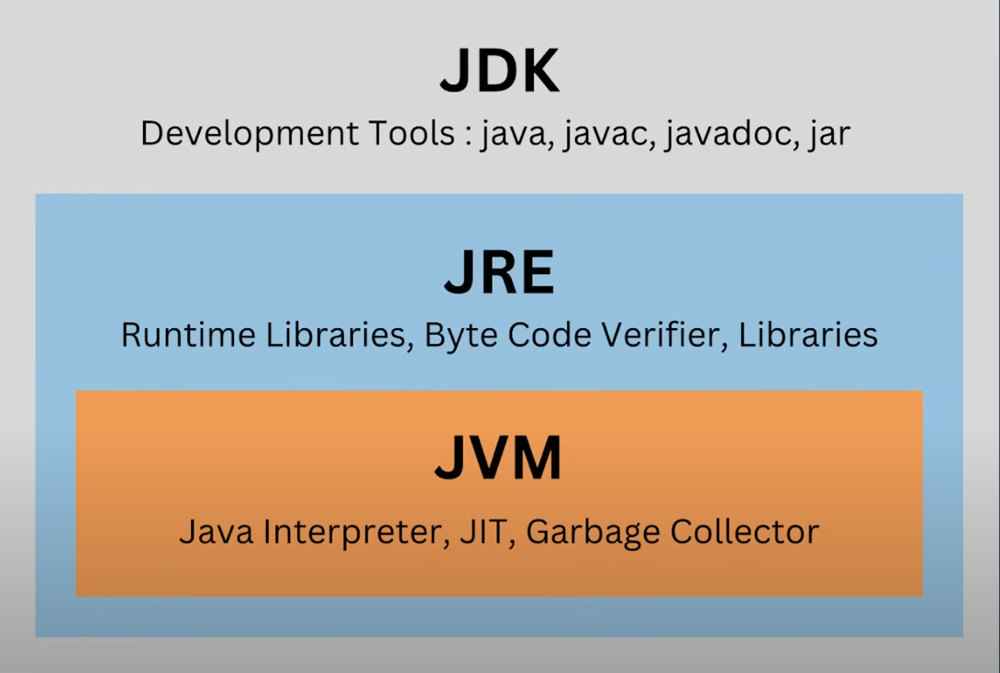
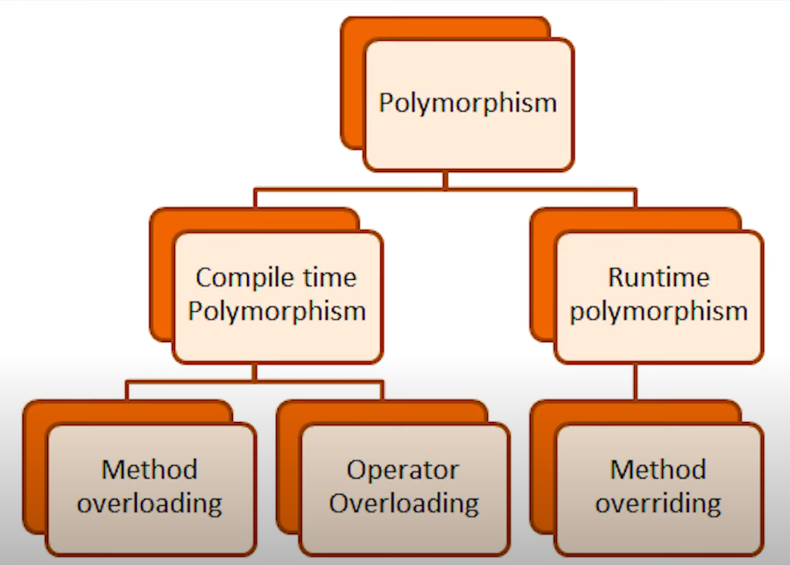

---

---



Java functions are called methods

Java is strict when it comes to syntax

```java
// Terminal outputs is
system.out.println();
```

## Data Types

Primitive

* int
* double
* float
* char
* boolean

Non-Primitive [objects you can do things to them]

* String
* int[]

### private vs public

private means it cannot be accessed out side the method without a getter and setter

public menas it can be accessed from any method

### Array

can store Strings integers and other none primitive data types

* !!! CAN NOT STORE OBJECTS !!!

### Access Modifiers

`private` - Most Restrictive

* visible ONLY within the class where it is initialized.
  * reason for getters and setters

```java
public class Player {
    private String name; // Only Player class can access this
    private int health;  // Other classes cannot see this
}
```

`default `- (package-private) - No Keyword

* Visible within the same package ONLY
* no access modifier keyword used

```java
class Helper {           // default access
    String packageData;  // default access
}
```

`protected`

* Visible within the same package + subclasses (even in different packages)
* used for inheritance scenarios

```java
public class Item {
    protected String name; // Subclasses can access this
}

public class Weapon extends Item {
    public void test() {
        this.name = "Sword"; // Can access protected field
    }
}
```

`public` - Least Restrictive

* visible everywhere
* can be accessed from any class, any package

```java
public class Player {
    public String getName() { // Anyone can call this
        return name;
    }
}
```

here is a table showing all the places the access modified variables can be visible:

| Modifier  | Same Class | Same Package | Subclass | Everywhere |
| --------- | ---------- | ------------ | -------- | ---------- |
| private   | ✅         | ❌           | ❌       | ❌         |
| default   | ✅         | ✅           | ❌       | ❌         |
| protected | ✅         | ✅           | ✅       | ❌         |
| protected | ✅         | ✅           | ✅       | ✅         |

## Collections (Data Structures)

### List

#### ArrayList

ArrayList is a collection

* a collections is a specialized subset of none primative data types
* stores and manages groups of objects

### Set

### Queue

### Map

## OOP Core

OOP organizes code into reusable, maintainable, and logical structures that model real-world relationships.

---

### Encapcilation

Encapcilation keeps our attributes safe and allows controlled ways to access and modify them.

### Inheritance

Inheritance is when one class(child/subclass) inherits properties and methods from another class (parent/superclass).

* creates an "is-a" relationship

```java
public class Consumables extends Item {
    // Consumables IS-A Item
    // Item is a super class and Consumables is a child
}
```

### Polymorphism

polymorphism means `Many-Forms`. It allows Objects of different Types to be treated as the same type, but behave differently.

```java
// Different object types
Weapons weapon1 = new Weapons("Chinese Sword", 1, 10, "Melee");
Item item4 = new Item("Bottle Caps", 10000);
MedicalSupplies medicalSupplies1 = new MedicalSupplies("Stimpack", 100, 75);
Consumables consumable1 = new Consumables("Nuka Cola", 5, "Drink");

// All treated as "Item" type
inventory.addItem(medicalSupplies1);  // MedicalSupplies as Item
inventory.addItem(weapon1);           // Weapons as Item
inventory.addItem(consumable1);       // Consumables as Item
inventory.addItem(item4);             // Item as Item
```



### Abstraction

Abstraction is hiding complex implementation details and showing only essential features to the user

**Real-world example:**

* **Car** - You know how to drive (gas pedal, brake, steering wheel)
* **Hidden complexity** - Engine mechanics, fuel injection, transmission details
* **You interact with** - Simple interface (pedals, wheel)

in Java, abstraction is achieved through:

1. Abstract Classes
   ```java
   public abstract class Player {
       // Common implementation (shared code)
       public String getName() { return name; }

       // Abstract method (must be implemented by subclasses)
       public abstract void displayPlayerInfo();
   }

   ```
2. Interfaces
   ```java
   public interface PlayerInterface {
       // Only method signatures (what, not how)
       String getName();
       void displayPlayerInfo();
   }

   /* 
   	PlayerInterface example:
   	What it shows: "All players must have these capabilities"
   	What it hides: "How each player type implements these capabilities"
   */
   ```

### Class

a class in java is a blueprint or template for creation of objects

it defines :

* Attributes (fields/variables)
  * what data the object stores
* Methods (funstions)
  * what actions the object can perform
* Constructor
  * how to create/initialize the object

```java
// Class Example with its various features

public class Inventory {
    // Attribute - stores data
    private ArrayList<Item> items;

    // Constructor - initializes the object
    public Inventory() {
        items = new ArrayList<>();
    }

    // Methods - define what the object can do
    public void addItem(Item item) {
        items.add(item);
    }

    public void displayItems() {
        // method implementation
    }
}
```

to actually build create objects using the class you created you use the "new" keyword

```java
Inventory myInventory = new Inventory(); // Creates an object from the class

// each object created using the new keyword creates a "copy" of the attributes but shares the same methods defined with in the class
```

### Object

this is the output of a class. its what is actually create from using the class template.

characteristics of an Object :

* **created using the `new` keyword**
* **has its own memory space** for storing attribute values
* **Can call methods** defined in its class
* **Each object is independent** (changing one does not affect the others)

```java
// Creating objects from the Inventory class
Inventory storeInventory = new Inventory();  // Object 1
Inventory warehouseInventory = new Inventory();  // Object 2

// Each object has its own data
storeInventory.addItem(someItem);     // Only affects storeInventory
warehouseInventory.addItem(otherItem); // Only affects warehouseInventory
```

## Loops

### Enhanced For Loop

this is the same as the for each loop in other languages like python.

Reads as for every item in this collection do what is in the {...}

```java
for(dataType variable : collection) {
    // code to execute for each element
}
```

## Concepts

### Method Overloading

this is when you hava multiples of the same method but with different paramenters

* this is consider compile time Polymorpism

```java
public class Calculator {
    public int add(int a, int b) {
        return a + b;
    }
  
    public double add(double a, double b) {  // Overloaded
        return a + b;
    }
  
    public int add(int a, int b, int c) {    // Overloaded
        return a + b + c;
    }
}
```

## Annotations

### @Override

annotation that marks a method as replacing a parent class method

```java
// Parent
@Override
public String toString() {
    return "Category: " + itemClass + ", Item: " + name + ", Quantity: " + quantity;
}

// Child
@Override
public String toString() {
    return "Category: " + itemClass + ", Item: " + getName() + ", Quantity: " + getQuantity() + ", Damage: " + damage + ", Type: " + type;
    }
```

## KeyWords

### static

the static keyword means that its **belongs to the class**, not the instance

Static Variables (Class Variables)

* shared by all instances of the class
* one copy exist, not per object

```java
public class Player {
    private static int totalPlayers = 0; // Shared by all Player objects
    private String name; // Each object has its own copy
  
    public Player(String name) {
        this.name = name;
        totalPlayers++; // Increments for all instances
    }
}

```

Static Methods

* called on class, not object
* cannot access non-static (instance) variables

```java
public class MathUtils {
    public static int add(int a, int b) {
        return a + b;
    }
}

// Usage
int result = MathUtils.add(5, 3); // No object needed

```

### final

variables, methods, and classes with final on it means that it cannot be changed

Final Variables (Constants)

* Cannot be reassigned after initialization
* Ususally combined with `static` for class constants

```java
public class GameConstants {
    public static final int MAX_HEALTH = 100;    // Class constant
    public static final String GAME_NAME = "RPG"; // Cannot change
  
    private final String playerId; // Instance constant
  
    public GameConstants(String id) {
        this.playerId = id; // Can only set once
    }
}
```

Final Methods

* Cannot be overriden by subclasses

```java
public class Player {
    public final void saveGame() { // Subclasses cannot override this
        // Critical save logic
    }
}
```

Final Classes

* Cannot be extended (no subclasses allowed)

```java
public final class String { // Cannot extend String class
    // String implementation
}
```

### super()

the super() keyword/method is a way of calling the parent constructor when extending a class

```java
public class Consumables extends Item {
    private String type;

    public Consumables(String type, String name, int quantity) {
        super(name, quantity); // super is used to call the parent class constructor
        this.type = type;
    }
}
```

### this

the `this` keyword is just java allowing you to have your parameters be the same as your attributes.

```java
public class item {
    private String name;
    private int quantity;

	public void Items(String name, int quantity) {
   	     this.name = name;
     	   this.quantity = quantity;
    	}
}
```
