# Algorithm Explanations for Gamers and Tech Enthusiasts

This document provides detailed explanations of key algorithms with real-world applications, gaming examples, and connections to AI/ML.

## Table of Contents
1. [Two Pointers](#two-pointers)
2. [Sliding Window](#sliding-window)
3. [HashMaps (Frequency Counting)](#hashmaps-frequency-counting)
4. [Sorting & Searching](#sorting--searching)
5. [Fast & Slow Pointers](#fast--slow-pointers)
6. [Linked List In-place Reversal](#linked-list-in-place-reversal)
7. [Linked List Merging](#linked-list-merging)
8. [Depth-First Search (DFS)](#depth-first-search-dfs)
9. [Breadth-First Search (BFS)](#breadth-first-search-bfs)
10. [Topological Sorting](#topological-sorting)
11. [Union-Find (Disjoint Set)](#union-find-disjoint-set)
12. [Dynamic Programming (DP)](#dynamic-programming-dp)
13. [Thread Safety, Locks, Deadlocks](#thread-safety-locks-deadlocks)

## Two Pointers

### What is it?
The Two Pointers technique uses two reference points that move through a data structure (usually an array) to solve problems efficiently. These pointers typically move toward or away from each other based on certain conditions.

### Visual Representation
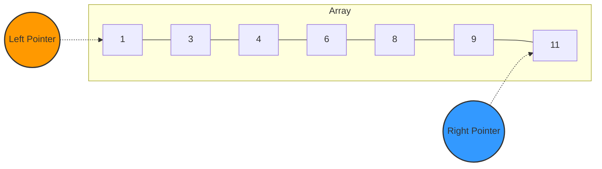

### Real-World Gaming Example
**Game Matchmaking Systems**: In competitive games like League of Legends or Overwatch, matchmaking algorithms use a two-pointer approach to pair players of similar skill levels. One pointer starts at the highest-ranked available player and another at the lowest, moving toward each other to find balanced teams.

### AI/ML Connection
**Efficient Dataset Processing**: In machine learning, when processing large datasets for training models, two-pointer techniques can be used to efficiently find pairs of data points that satisfy certain conditions (like finding the closest pairs of points in a dataset for clustering algorithms).

### Code Example
```python
def find_pair_with_target_sum(arr, target_sum):
    left, right = 0, len(arr) - 1
    
    while left < right:
        current_sum = arr[left] + arr[right]
        
        if current_sum == target_sum:
            return [left, right]
        
        if current_sum < target_sum:
            left += 1  # Need a larger sum, move left pointer right
        else:
            right -= 1  # Need a smaller sum, move right pointer left
            
    return [-1, -1]  # No pair found
```

## Sliding Window

### What is it?
The Sliding Window technique maintains a "window" of elements that slides through an array or string to efficiently solve problems involving subarrays or substrings.

### Visual Representation
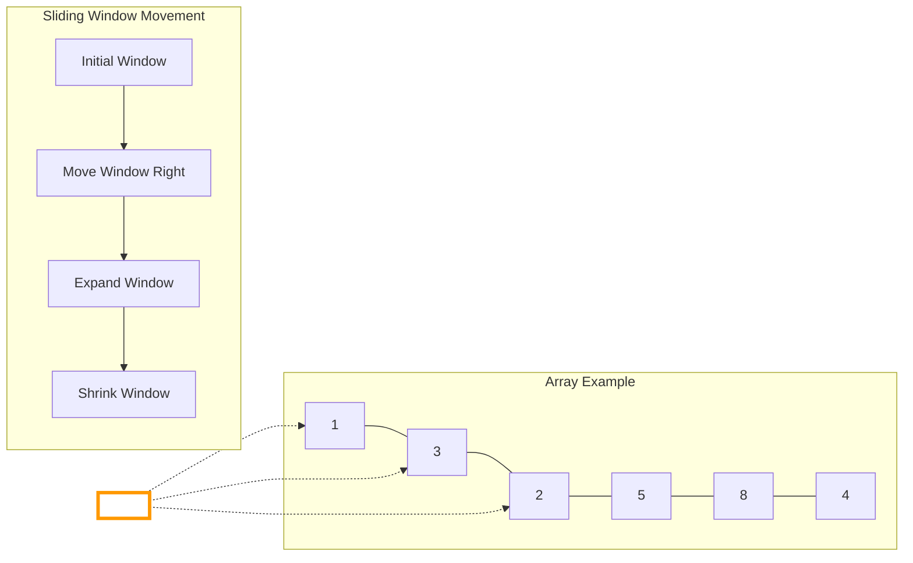

### Real-World Gaming Example
**Frame Rate Optimization**: In game development, sliding window algorithms are used to calculate the average frame rate over the last N frames. This helps in dynamically adjusting graphics settings to maintain smooth gameplay.

**Minimap Fog of War**: In strategy games like StarCraft or Age of Empires, the "fog of war" system uses sliding window concepts to reveal portions of the map as units move through them.

### AI/ML Connection
**Time Series Analysis**: In AI systems that analyze player behavior over time, sliding windows help detect patterns in player actions, like identifying a player's skill improvement curve or detecting unusual behavior that might indicate cheating.

**Convolutional Neural Networks**: The core operation in CNNs (used in computer vision and image recognition) is essentially a sliding window operation where filters slide across input data to extract features.

### Code Example
```python
def max_sum_subarray_of_size_k(arr, k):
    max_sum = 0
    window_sum = 0
    window_start = 0
    
    for window_end in range(len(arr)):
        window_sum += arr[window_end]  # Add the next element
        
        # Slide the window once we hit size k
        if window_end >= k - 1:
            max_sum = max(max_sum, window_sum)
            window_sum -= arr[window_start]  # Remove the element going out
            window_start += 1  # Slide the window ahead
            
    return max_sum
```

## HashMaps (Frequency Counting)

### What is it?
HashMaps (or dictionaries/hash tables) are data structures that store key-value pairs and allow for efficient lookups, insertions, and deletions. Frequency counting is a common pattern that uses HashMaps to count occurrences of elements.

### Visual Representation
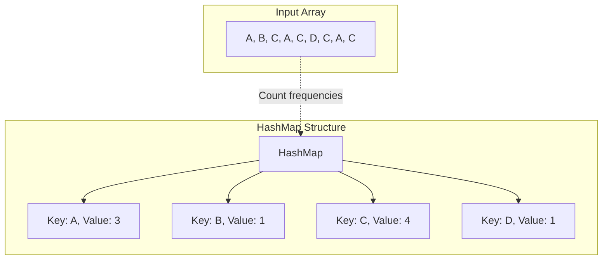

### Real-World Gaming Example
**Item Inventory Systems**: In games like Minecraft or Diablo, inventory systems use HashMaps to track the quantity of each item a player possesses.

**Achievement Tracking**: Games track player achievements using HashMaps to count specific actions (e.g., "Kill 100 enemies" or "Collect 50 coins").

### AI/ML Connection
**Feature Extraction**: In natural language processing for game chatbots, HashMaps count word frequencies to understand player intent or sentiment.

**Recommendation Systems**: Game stores like Steam use frequency counting to analyze which game genres a player engages with most often to recommend similar games.

### Code Example
```python
def find_most_frequent_character(text):
    # Create a HashMap to store character frequencies
    char_frequency = {}
    
    # Count the frequency of each character
    for char in text:
        if char in char_frequency:
            char_frequency[char] += 1
        else:
            char_frequency[char] = 1
    
    # Find the character with the highest frequency
    max_freq = 0
    most_frequent_char = None
    
    for char, freq in char_frequency.items():
        if freq > max_freq:
            max_freq = freq
            most_frequent_char = char
            
    return most_frequent_char, max_freq
```

## Sorting & Searching

### What is it?
Sorting algorithms arrange elements in a specific order (ascending/descending), while searching algorithms find the position of a target element within a collection.

### Visual Representation
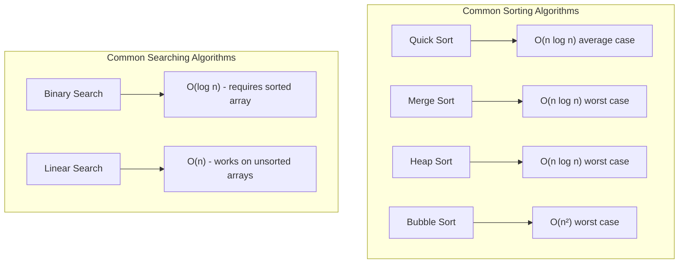

### Real-World Gaming Example
**Leaderboards**: Online games use sorting algorithms to maintain leaderboards ranking players by score, win rate, or other metrics.

**Pathfinding**: Games like Civilization or Age of Empires use searching algorithms (often A* search) to find the optimal path for units to move across the game map.

### AI/ML Connection
**Training Data Preparation**: Before training machine learning models for game AI, data is often sorted by features to improve training efficiency.

**Decision Trees**: In game AI that uses decision trees (like chess engines), binary search principles help efficiently navigate possible moves.

## Searching Algorithms

### 1. Linear Search

**How it works**: Sequentially checks each element in a collection until it finds the target value or reaches the end.

**Time Complexity**: O(n) - must potentially check every element

**Best for**: Small arrays or unsorted collections where sorting would be more expensive than searching

**Gaming Example**: Inventory systems in games like Minecraft when searching for a specific item in an unsorted inventory

```python
def linear_search(arr, target):
    for i in range(len(arr)):
        if arr[i] == target:
            return i  # Return the index of the found element
    return -1  # Element not found
```

### 2. Binary Search

**How it works**: Repeatedly divides the search interval in half, eliminating half of the remaining elements each time

**Time Complexity**: O(log n) - the search space is halved with each step

**Best for**: Sorted arrays where you need to find elements quickly

**Gaming Example**: Finding the appropriate difficulty level in a game based on player skill rating

```python
def binary_search(arr, target):
    left, right = 0, len(arr) - 1
    
    while left <= right:
        mid = (left + right) // 2
        
        if arr[mid] == target:
            return mid  # Found the target
        
        if arr[mid] < target:
            left = mid + 1  # Target is in the right half
        else:
            right = mid - 1  # Target is in the left half
            
    return -1  # Target not found
```

## Sorting Algorithms

### 1. Bubble Sort

**How it works**: Repeatedly steps through the list, compares adjacent elements, and swaps them if they're in the wrong order

**Time Complexity**: 
- Best case: O(n) when array is already sorted
- Average/Worst case: O(n²)

**Best for**: Educational purposes or very small datasets

**Gaming Example**: Sorting a small list of high scores in a simple arcade game

```python
def bubble_sort(arr):
    n = len(arr)
    for i in range(n):
        # Flag to optimize if array is already sorted
        swapped = False
        
        # Last i elements are already in place
        for j in range(0, n-i-1):
            if arr[j] > arr[j+1]:
                arr[j], arr[j+1] = arr[j+1], arr[j]
                swapped = True
        
        # If no swapping occurred in this pass, array is sorted
        if not swapped:
            break
    
    return arr
```

### 2. Quick Sort

**How it works**: Selects a 'pivot' element and partitions the array around it, then recursively sorts the sub-arrays

**Time Complexity**:
- Average case: O(n log n)
- Worst case: O(n²) when poorly chosen pivots

**Best for**: General-purpose sorting when average-case performance matters more than worst-case

**Gaming Example**: Sorting entities in a game world based on distance from the player for rendering optimization

```python
def quick_sort(arr):
    if len(arr) <= 1:
        return arr
    
    pivot = arr[len(arr) // 2]  # Choose middle element as pivot
    left = [x for x in arr if x < pivot]
    middle = [x for x in arr if x == pivot]
    right = [x for x in arr if x > pivot]
    
    return quick_sort(left) + middle + quick_sort(right)
```

### 3. Merge Sort

**How it works**: Divides the array into halves, sorts each half, then merges the sorted halves

**Time Complexity**: O(n log n) in all cases

**Best for**: Stable sorting where consistent performance is required

**Gaming Example**: Sorting game assets by load priority during level initialization

```python
def merge_sort(arr):
    if len(arr) <= 1:
        return arr
    
    # Divide array in half
    mid = len(arr) // 2
    left_half = arr[:mid]
    right_half = arr[mid:]
    
    # Recursive calls
    left_half = merge_sort(left_half)
    right_half = merge_sort(right_half)
    
    # Merge the sorted halves
    return merge(left_half, right_half)

def merge(left, right):
    result = []
    i = j = 0
    
    # Compare elements from both arrays and add smaller one to result
    while i < len(left) and j < len(right):
        if left[i] <= right[j]:
            result.append(left[i])
            i += 1
        else:
            result.append(right[j])
            j += 1
    
    # Add remaining elements
    result.extend(left[i:])
    result.extend(right[j:])
    return result
```

### 4. Heap Sort

**How it works**: Builds a max-heap from the array, then repeatedly extracts the maximum element

**Time Complexity**: O(n log n) in all cases

**Best for**: Systems with limited memory where merge sort's extra space is problematic

**Gaming Example**: Sorting game objects by priority in a scene graph for rendering

```python
def heap_sort(arr):
    n = len(arr)
    
    # Build a max heap
    for i in range(n // 2 - 1, -1, -1):
        heapify(arr, n, i)
    
    # Extract elements one by one
    for i in range(n - 1, 0, -1):
        arr[0], arr[i] = arr[i], arr[0]  # Swap
        heapify(arr, i, 0)
    
    return arr

def heapify(arr, n, i):
    largest = i
    left = 2 * i + 1
    right = 2 * i + 2
    
    # Check if left child exists and is greater than root
    if left < n and arr[left] > arr[largest]:
        largest = left
    
    # Check if right child exists and is greater than largest so far
    if right < n and arr[right] > arr[largest]:
        largest = right
    
    # Change root if needed
    if largest != i:
        arr[i], arr[largest] = arr[largest], arr[i]  # Swap
        heapify(arr, n, largest)  # Heapify the affected sub-tree
```

### Comparison of Sorting Algorithms

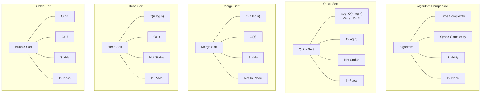

## Fast & Slow Pointers

### What is it?
The Fast & Slow Pointers technique (also known as the "Tortoise and Hare" algorithm) uses two pointers that move through a data structure at different speeds to solve problems related to cycles or finding middle elements.

### Visual Representation
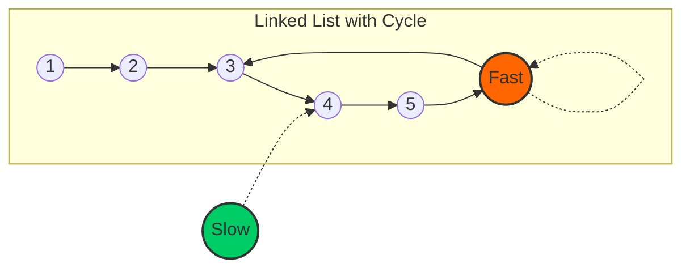

### Real-World Gaming Example
**Race Track Games**: In racing games like Mario Kart, the "rubber-banding" AI uses a concept similar to fast and slow pointers to keep AI racers at an engaging distance from the player.

**NPC Movement Patterns**: In open-world games, NPCs often move in cycles (patrol routes), and detecting these cycles efficiently is important for AI behavior and optimization.

### AI/ML Connection
**Anomaly Detection**: In game analytics, fast and slow pointer concepts help detect unusual patterns in player behavior that might indicate cheating or exploits.

**Reinforcement Learning Cycles**: When training game AI using reinforcement learning, detecting cycles in state spaces helps avoid redundant exploration.

### Code Example - Detecting a Cycle
```python
def has_cycle(head):
    if not head or not head.next:
        return False
    
    # Initialize slow and fast pointers
    slow = head
    fast = head
    
    # Move slow by one step and fast by two steps
    while fast and fast.next:
        slow = slow.next           # Move slow pointer by 1
        fast = fast.next.next      # Move fast pointer by 2
        
        # If they meet, there's a cycle
        if slow == fast:
            return True
    
    # If fast reaches the end, there's no cycle
    return False
```

## Linked List In-place Reversal

### What is it?
Linked List In-place Reversal is a technique to reverse a linked list or parts of it without using extra space by manipulating the pointers directly.

### Visual Representation
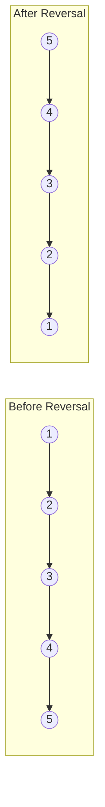

### Real-World Gaming Example
**Undo/Redo Systems**: In strategy games or puzzle games, the history of moves can be stored as a linked list, and reversing portions of it allows for efficient undo/redo functionality.

**Animation Sequences**: Game animations often use linked lists to store sequences of movements, and reversing these lists allows for playing animations backward.

### AI/ML Connection
**Neural Network Backpropagation**: The concept of reversing direction and propagating information backward is fundamental to training neural networks used in game AI.

**Bidirectional Search**: In pathfinding algorithms for game AI, bidirectional search techniques use concepts similar to linked list reversal to efficiently find paths.

### Code Example - Reversing a Linked List
```python
def reverse_linked_list(head):
    previous = None
    current = head
    
    while current:
        # Store next node before we change the pointer
        next_node = current.next
        
        # Reverse the pointer
        current.next = previous
        
        # Move pointers one position ahead
        previous = current
        current = next_node
    
    # The new head is the previous last node
    return previous
```

## Linked List Merging

### What is it?
Linked List Merging involves combining two or more linked lists into a single list, often while maintaining some ordering property (like keeping the merged list sorted).

### Visual Representation
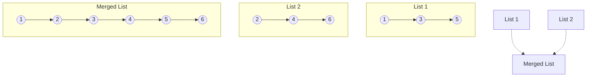

### Real-World Gaming Example
**Quest Systems**: In RPGs like The Witcher or Skyrim, quest systems often merge multiple quest paths based on player choices, similar to merging linked lists.

**Game Save Merging**: When games allow multiple save files to be merged (like in some strategy games where you can combine different campaigns), the underlying data structures use merging techniques.

### AI/ML Connection
**Ensemble Learning**: In game AI that uses ensemble learning (combining multiple AI models), the process of merging predictions from different models is conceptually similar to linked list merging.

**Feature Combination**: When training ML models for game analytics, features from different data sources are merged in ways similar to linked list merging.

### Code Example - Merging Two Sorted Lists
```python
def merge_two_sorted_lists(l1, l2):
    # Create a dummy head node
    dummy = ListNode(-1)
    current = dummy
    
    # Compare elements from both lists and merge
    while l1 and l2:
        if l1.val <= l2.val:
            current.next = l1
            l1 = l1.next
        else:
            current.next = l2
            l2 = l2.next
        current = current.next
    
    # Attach remaining nodes
    if l1:
        current.next = l1
    if l2:
        current.next = l2
    
    return dummy.next
```

## Depth-First Search (DFS)

### What is it?
Depth-First Search is an algorithm for traversing or searching tree or graph data structures by exploring as far as possible along each branch before backtracking.

### Visual Representation
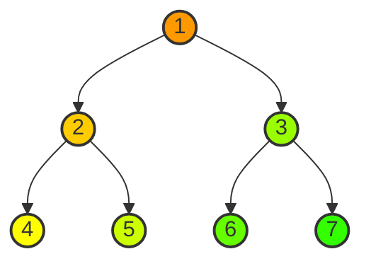

### Real-World Gaming Example
**Maze Generation**: Games like Minecraft use DFS to generate complex cave systems and mazes.

**Game State Exploration**: In chess engines and other strategy game AIs, DFS is used to explore possible future game states (the game tree).

**Quest Progression**: In narrative-driven games, DFS helps manage complex branching storylines and quest dependencies.

### AI/ML Connection
**Decision Trees**: In game AI that uses decision trees, DFS is the fundamental algorithm for exploring possible decision paths.

**Reinforcement Learning**: When training game AI using reinforcement learning, DFS-like exploration strategies help the AI discover optimal policies.

### Code Example - DFS on a Graph
```python
def dfs(graph, start, visited=None):
    if visited is None:
        visited = set()
    
    # Mark the current node as visited
    visited.add(start)
    print(start, end=' ')  # Process the current node
    
    # Recursively visit all adjacent nodes
    for neighbor in graph[start]:
        if neighbor not in visited:
            dfs(graph, neighbor, visited)
    
    return visited
```

## Breadth-First Search (BFS)

### What is it?
Breadth-First Search is an algorithm for traversing or searching tree or graph data structures by exploring all nodes at the present depth before moving on to nodes at the next depth level.

### Visual Representation
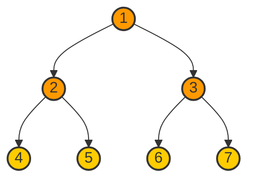

### Real-World Gaming Example
**Pathfinding**: Games like Warcraft or StarCraft use BFS for unit movement to find the shortest path to a destination.

**Area of Effect Calculations**: When calculating splash damage or buff effects in games like League of Legends, BFS helps determine which units are affected based on proximity.

**Level Generation**: Procedural level generators in roguelike games often use BFS to ensure all areas of a level are accessible.

### AI/ML Connection
**Nearest Neighbor Search**: In game AI that needs to identify nearby entities quickly, BFS provides an efficient way to search outward from a point.

**Image Recognition**: Computer vision systems used in AR games employ BFS-like algorithms to identify connected components in images.

### Code Example - BFS on a Graph
```python
from collections import deque

def bfs(graph, start):
    # Create a queue for BFS
    queue = deque([start])
    visited = set([start])
    
    while queue:
        # Dequeue a vertex from queue
        vertex = queue.popleft()
        print(vertex, end=" ")
        
        # Get all adjacent vertices
        # If an adjacent vertex hasn't been visited, mark it visited and enqueue it
        for neighbor in graph[vertex]:
            if neighbor not in visited:
                visited.add(neighbor)
                queue.append(neighbor)
```

## Topological Sorting

### What is it?
Topological Sorting is an algorithm for ordering the vertices of a directed acyclic graph (DAG) such that for every directed edge (u, v), vertex u comes before vertex v in the ordering.

### Visual Representation
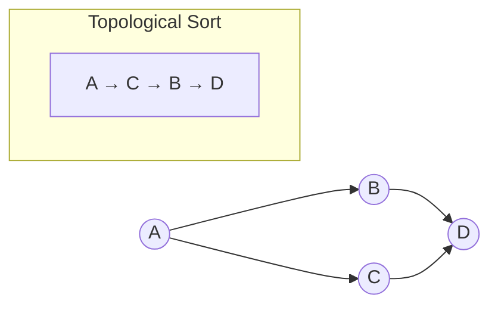

### Real-World Gaming Example
**Quest Dependencies**: In RPGs like The Elder Scrolls, quest systems use topological sorting to determine the order in which quests can be completed based on their dependencies.

**Tech Trees**: Strategy games like Civilization use topological sorting to manage technology research paths, ensuring prerequisites are met before advanced technologies become available.

**Level Unlocking**: Mobile games with level progression use topological sorting to determine which levels should be unlocked based on completed prerequisites.

### AI/ML Connection
**Neural Network Layer Processing**: In deep learning systems for game AI, the layers of a neural network form a DAG, and topological sorting determines the order of computation.

**Dependency Resolution**: When training complex AI models with multiple components, topological sorting helps resolve the order in which different parts of the model should be trained.

### Code Example - Topological Sort
```python
def topological_sort(graph):
    # Count incoming edges for each vertex
    in_degree = {u: 0 for u in graph}
    for u in graph:
        for v in graph[u]:
            in_degree[v] += 1
    
    # Queue vertices with no incoming edges
    from collections import deque
    queue = deque([u for u in graph if in_degree[u] == 0])
    
    result = []
    while queue:
        # Remove a vertex with no incoming edges
        u = queue.popleft()
        result.append(u)
        
        # Reduce in-degree of adjacent vertices
        for v in graph[u]:
            in_degree[v] -= 1
            # If in-degree becomes 0, add to queue
            if in_degree[v] == 0:
                queue.append(v)
    
    # Check if there was a cycle
    if len(result) != len(graph):
        return None  # Graph has a cycle
    
    return result
```

## Union-Find (Disjoint Set)

### What is it?
Union-Find is a data structure that keeps track of elements which are split into one or more disjoint sets. It provides near-constant-time operations to add new sets, merge existing sets, and determine whether elements are in the same set.

### Visual Representation
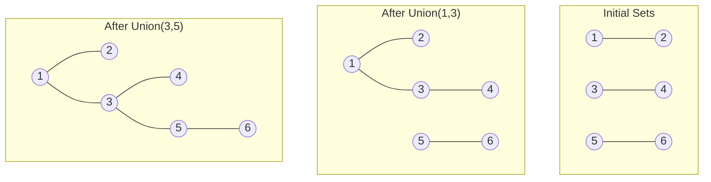

### Real-World Gaming Example
**Territory Control**: In strategy games like Risk or Civilization, Union-Find helps track which territories belong to which players, especially when territories merge after conquests.

**Connected Components**: In multiplayer games with team-based mechanics, Union-Find efficiently tracks which players are on the same team or alliance.

**Maze Generation**: Some maze generation algorithms use Union-Find to ensure the maze has a path between any two cells.

### AI/ML Connection
**Clustering Algorithms**: In game analytics, Union-Find is used in clustering algorithms to group similar player behaviors or game states.

**Image Segmentation**: In computer vision for AR games, Union-Find helps segment images into distinct regions based on similarity.

### Code Example - Union-Find Implementation
```python
class UnionFind:
    def __init__(self, n):
        # Initially, each element is its own parent
        self.parent = list(range(n))
        # Rank is used for union by rank optimization
        self.rank = [0] * n
    
    def find(self, x):
        # Find the root of x with path compression
        if self.parent[x] != x:
            self.parent[x] = self.find(self.parent[x])
        return self.parent[x]
    
    def union(self, x, y):
        # Union by rank
        root_x = self.find(x)
        root_y = self.find(y)
        
        if root_x == root_y:
            return
        
        if self.rank[root_x] < self.rank[root_y]:
            self.parent[root_x] = root_y
        else:
            self.parent[root_y] = root_x
            if self.rank[root_x] == self.rank[root_y]:
                self.rank[root_x] += 1
    
    def connected(self, x, y):
        # Check if x and y are in the same set
        return self.find(x) == self.find(y)
```

## Dynamic Programming (DP)

### What is it?
Dynamic Programming is a method for solving complex problems by breaking them down into simpler subproblems and storing the results to avoid redundant calculations.

### Visual Representation
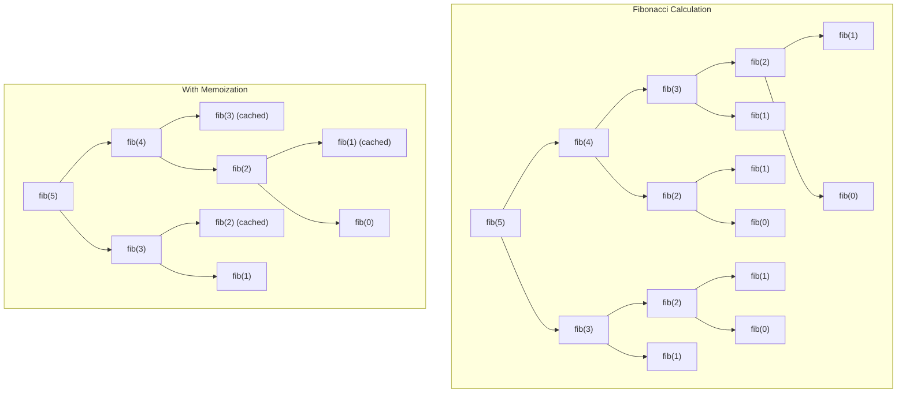

### Real-World Gaming Example
**Inventory Management**: In games like Diablo or Path of Exile, DP algorithms optimize inventory space by solving the "knapsack problem" to determine the most valuable items to keep.

**AI Decision Making**: Strategy game AIs use DP to evaluate possible moves and their consequences several steps ahead.

**Procedural Content Generation**: Games with procedurally generated levels use DP to ensure levels have desired properties (difficulty, solvability, etc.).

### AI/ML Connection
**Reinforcement Learning**: The core of reinforcement learning (used in game AI like AlphaGo) is based on dynamic programming principles, particularly the Bellman equation.

**Sequence Prediction**: In games that try to predict player behavior, DP algorithms help analyze sequences of actions to make predictions.

### Code Example - Fibonacci with DP
```python
# Memoization approach (top-down)
def fibonacci_memo(n, memo={}):
    if n in memo:
        return memo[n]
    if n <= 1:
        return n
    
    memo[n] = fibonacci_memo(n-1, memo) + fibonacci_memo(n-2, memo)
    return memo[n]

# Tabulation approach (bottom-up)
def fibonacci_tab(n):
    if n <= 1:
        return n
    
    dp = [0] * (n + 1)
    dp[1] = 1
    
    for i in range(2, n + 1):
        dp[i] = dp[i-1] + dp[i-2]
    
    return dp[n]
```

## Thread Safety, Locks, Deadlocks

### What is it?
Thread safety refers to the property of code that can safely be executed by multiple threads simultaneously without causing data corruption or unexpected behavior. Locks are mechanisms to ensure thread safety, while deadlocks are situations where two or more threads are blocked forever, waiting for each other.

### Visual Representation
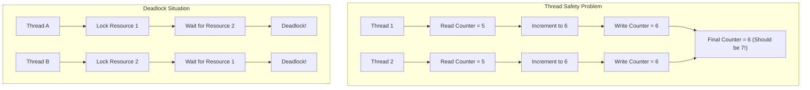

### Real-World Gaming Example
**Multiplayer Game Servers**: In games like Fortnite or World of Warcraft, thread safety mechanisms ensure that when multiple players interact with the same game object simultaneously, the game state remains consistent.

**Physics Engines**: Game physics engines use locks to ensure that when multiple objects are colliding or interacting, their positions and velocities are updated correctly without race conditions.

### AI/ML Connection
**Parallel Training**: When training complex game AI models on multiple GPUs, thread safety and proper locking mechanisms ensure that model parameters are updated correctly.

**Distributed Reinforcement Learning**: In distributed RL systems for training game AI (like OpenAI's Dota 2 AI), avoiding deadlocks is crucial for efficient training across multiple machines.

### Code Example - Thread Safety with Locks
```python
import threading

class ThreadSafeCounter:
    def __init__(self):
        self.value = 0
        self.lock = threading.Lock()
    
    def increment(self):
        # Acquire lock before modifying shared resource
        with self.lock:
            self.value += 1
    
    def get_value(self):
        # Acquire lock before reading shared resource
        with self.lock:
            return self.value

# Example of avoiding deadlock with ordered lock acquisition
def transfer(account_from, account_to, amount):
    # Always acquire locks in a consistent order to prevent deadlocks
    first_lock = account_from.lock if id(account_from) < id(account_to) else account_to.lock
    second_lock = account_to.lock if id(account_from) < id(account_to) else account_from.lock
    
    with first_lock:
        with second_lock:
            account_from.balance -= amount
            account_to.balance += amount
```

## Conclusion

These algorithm patterns form the foundation of many complex systems in gaming, electronics, and AI/ML. By understanding these patterns and their applications, you can:

1. Design more efficient game systems
2. Optimize performance in resource-constrained environments
3. Develop more intelligent AI behaviors
4. Solve complex problems in your own projects

Remember that mastering these patterns takes practice. Try implementing them in small projects related to your interests in gaming and AI to solidify your understanding.

Happy coding!