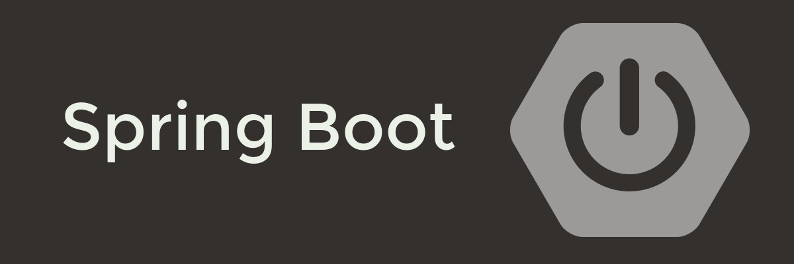

# Spring Boot Basics

* What is Spring & Spring Boot (difference from traditional Spring)
* Project setup with Spring Initializr
* Application structure (`@SpringBootApplication`)
* Dependency injection & IoC (`@Component`, `@Autowired`, `@Bean`)

# Building Rest APIs

* `@RestController`, `@RequestMapping`, `@GetMapping`, `@PostMapping`, etc.
* Request handling (`@PathVariable`, `@RequestParam`, `@RequestBody`)
* ResponseEntity & HTTP status codes
* Exception handling (`@ControllerAdvice`, `@ExceptionHandler`)

# Data & Persitence

* Spring Data JPA basics
* Entities & Repositories (`@Entity`, `@Repository`)
* CRUD operations with JPA (`findAll`, `save`, `delete`)
* Query methods & JPQL
* Database migrations with Flyway/Liquibase

# Configuring & Profiles

* `application.properties` vs `application.yml`
* Profiles (`dev`, `test`, `prod`)
* Externalized configuration (environment variables)

# Security

* Introduction to Spring Security
* Basic authentication & JWT-based authentication
* Role-based authorization

# Testing in Spring Boot

* Unit tests with JUnit & Mockito
* Integration tests (`@SpringBootTest`)
* MockMvc for REST API testing

# Advanced Spring Boot

* Actuator (health checks, metrics)
* Caching (`@Cacheable`)
* Asynchronous methods (`@Async`)
* Scheduling (`@Scheduled`)
* Event-driven development (`ApplicationEventPublisher`)

# Microservices with Spring Boot

* REST API communication
* Service discovery (Eureka)
* API Gateway (Spring Cloud Gateway)
* Config server & centralized configuration
* Resilience patterns (Circuit Breaker with Resilience4j/Hystrix)

# Deployment

* Packaging as JAR vs WAR
* Running with embedded Tomcat
* Dockerizing Spring Boot apps
* Deploying to AWS (EC2, Elastic Beanstalk, or Kubernetes)
