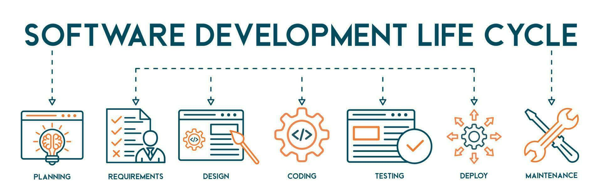

# Planning & Requirements

* Gathering requirements (business, functional, non-functional)
* Feasibility study (technical, operational, financial)
* Defining scope & success criteria

# System Design

* High-Level Design (architecture, tech stack, system diagrams)
* Low-Level Design (detailed module/class diagrams, database schema)
* UI/UX design

# Implementaion (Development)

* Writing code following standards
* Using version control (Git, branching strategies)
* Applying coding best practices (clean code, design patterns)

# Testing

* Unit Testing
* Integration Testing
* System Testing
* User Acceptance Testing (UAT)
* Automated vs Manual testing

# Deployment

* Release planning
* CI/CD pipelines
* Environment setup (dev, test, staging, production)
* Rollbacks & hotfixes

# Maintence & Operations

* Monitoring (logging, alerts, observability)
* Bug fixing
* Security patches
* Performance tuning
* Scaling & upgrades
