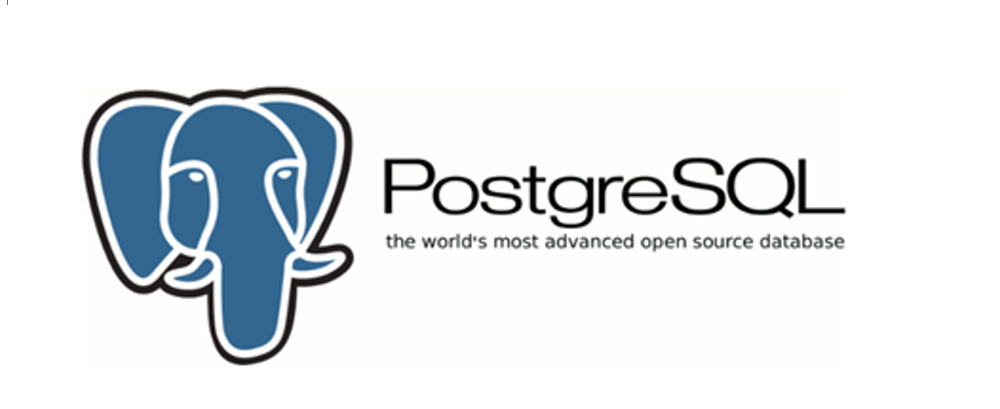

# Core SQL Basics

* ✅ Understanding relational databases (tables, rows, columns).
* ✅ Primary keys, foreign keys, and relationships.
* ✅ Basic CRUD operations (`SELECT`, `INSERT`, `UPDATE`, `DELETE`).
* ✅ Filtering (`WHERE`, `AND`, `OR`, `IN`, `BETWEEN`, `LIKE`).
* ✅ Sorting and limiting (`ORDER BY`, `LIMIT`).

# Joins & Relationships

* ✅ Inner, Left, Right, and Full Joins.
* ✅ Self-joins.
* ✅ Cross joins.
* ✅ Many-to-many relationships with join tables.

# Aggregation & Grouping

* ✅ `GROUP BY` and `HAVING`.
* ✅ Aggregate functions (`COUNT`, `SUM`, `AVG`, `MIN`, `MAX`).

# Subqueries & Advanced Queries

* ✅ Subqueries in `WHERE`, `FROM`, and `SELECT`.
* ✅ Common Table Expressions (CTEs) with `WITH`.
* 🟣 Recursive CTEs (`WITH RECURSIVE`).

# Data Types

* ✅ Common SQL types: `INT`, `VARCHAR`, `BOOLEAN`, `DATE`, `DECIMAL`.
* 🟣 PostgreSQL extras:

  * `JSON` / `JSONB` (queryable JSON).
  * `ARRAY`.
  * `UUID`.
  * `HSTORE` (key-value).
  * Geospatial types (via PostGIS).

# Indexes & Performance

* ✅ B-Tree indexes.
* ✅ Query optimization with `EXPLAIN`.
* 🟣 Advanced Postgres indexes:

  * GIN (great for JSONB & full-text search).
  * GiST, BRIN.
  * Partial indexes (conditional).
  * Expression indexes (functions/computed values).

# Transaction & Concurrency

* ✅ ACID principles.
* ✅ Transaction control (`BEGIN`, `COMMIT`, `ROLLBACK`).
* ✅ Isolation levels.
* 🟣 Postgres-specific concurrency with **MVCC** (Multi-Version Concurrency Control).
* 🟣 Savepoints inside transactions.

# Views, Functions, & Triggers

* ✅ Creating and using views.
* ✅ Stored procedures/functions.
* ✅ Triggers and constraints (e.g., `CHECK`).
* 🟣 Postgres procedural language (`PL/pgSQL`).

# Security & Permissions

* ✅ User roles and privileges (`GRANT`, `REVOKE`).
* ✅ SQL Injection awareness.
* 🟣 Row-level security (RLS) in PostgreSQL.
* 🟣 `pgcrypto` for encryption.

# Extensions & Ecosystem

* 🟣 PostGIS for geospatial queries.
* 🟣 `uuid-ossp` for UUIDs.
* 🟣 Foreign Data Wrappers (query external DBs from Postgres).

# Advanced Query Features

* ✅ Window functions (`ROW_NUMBER`, `RANK`, `DENSE_RANK`, `LAG`, `LEAD`).
* 🟣 Full-text search in PostgreSQL.
