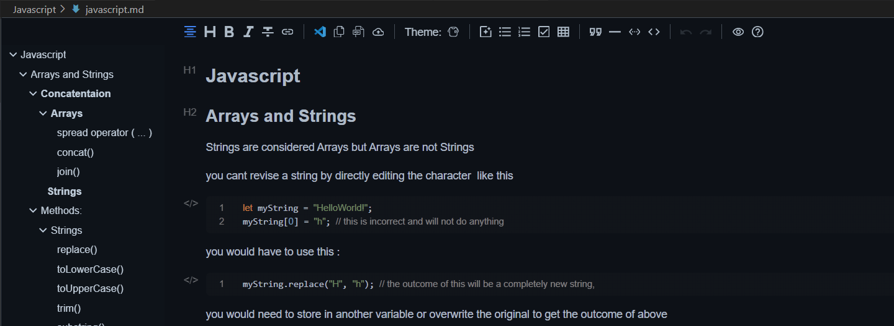

# Setting Preferences

# Extension Preferences

## Office Viewer

* View word,excel files and using WYSIWYG editor for markdown.
* allows you to use MD files as as a note taking tool without know all the special commands for MD language

  

## Markdown Preview Mermaid Support

* Adds Mermaid diagram and flowchart support to VS Code's builtin markdown preview

# Terminals Preferences

1. Z Shell
   * would need WSL (Windows Subsystem for Linux)
2. Git Bash
3. Powershell
